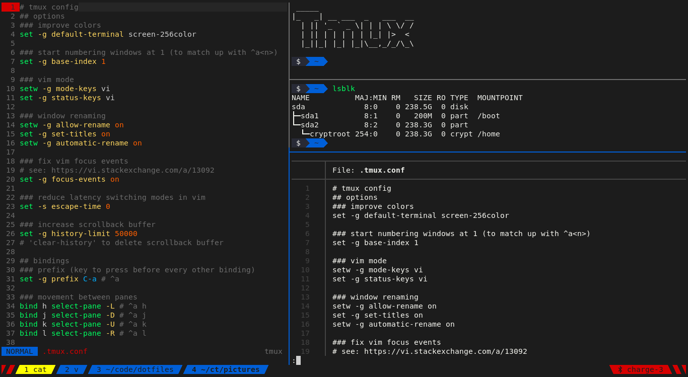
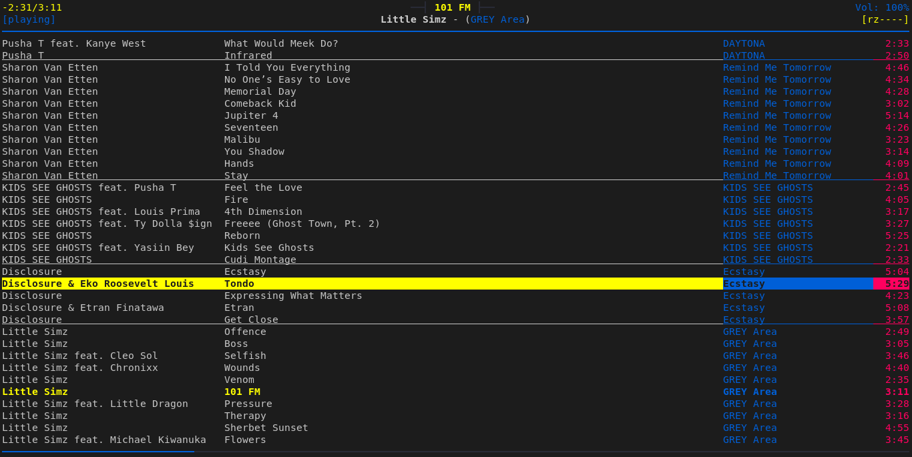

# dotfiles

> My arch linux setup and beyond

See [the repo directoy](repo/#readme) for how these dotfiles are managed.

To see updates you can watch the Github releases, where I will regularly
document the changes that I've done.

<!-- big screenshots here -->

<details>
<summary><strong>Table of Contents</strong></summary>
<!-- START doctoc generated TOC please keep comment here to allow auto update -->
<!-- DON'T EDIT THIS SECTION, INSTEAD RE-RUN doctoc TO UPDATE -->

- [Terminal apps](#terminal-apps)
  - [zsh (shell)](#zsh-shell)
  - [tmux (terminal mutiplexer)](#tmux-terminal-mutiplexer)
  - [neovim (terminal editor)](#neovim-terminal-editor)
  - [lf (file manager)](#lf-file-manager)
  - [git (version control)](#git-version-control)
  - [mpd + ncmpcpp (music player)](#mpd--ncmpcpp-music-player)
  - [remind (calendar)](#remind-calendar)
  - [newsboat (RSS feed reader)](#newsboat-rss-feed-reader)
  - [hledger (accounting)](#hledger-accounting)
  - [& more](#-more)
- [GUI apps](#gui-apps)
  - [kitty (terminal)](#kitty-terminal)
  - [emacs (editor)](#emacs-editor)
  - [mpv (video/audio player)](#mpv-videoaudio-player)
  - [rofi (application launcher/dmenu)](#rofi-application-launcherdmenu)
  - [signal (messager)](#signal-messager)
  - [transmission (torrent daemon)](#transmission-torrent-daemon)
  - [GIMP (photoshop)](#gimp-photoshop)
  - [Keepass (password manager)](#keepass-password-manager)
  - [Syncthing (dropbox)](#syncthing-dropbox)
  - [& more](#-more-1)
- [System apps](#system-apps)
  - [i3 (window manager)](#i3-window-manager)
  - [sxhkd (hotkey daemon)](#sxhkd-hotkey-daemon)
  - [lock screen](#lock-screen)
  - [pipewire (audio)](#pipewire-audio)
- [Browser & Extensions](#browser--extensions)
  - [Essential extensions](#essential-extensions)
  - [Useful](#useful)
    - [Specific Websites](#specific-websites)
  - [Privacy](#privacy)
  - [Maybe](#maybe)
- [Android apps](#android-apps)
- [MacOS](#macos)

<!-- END doctoc generated TOC please keep comment here to allow auto update -->
</details>

## Terminal apps

### zsh (shell)

Superior shell, extends bash/posix.

I'm using a stripped down version of
[oh-my-zsh](https://github.com/robbyrussell/oh-my-zsh) with a lot of custom
aliases.

- [entrypoint](.zshrc)
- [configs, aliases](.zsh)
- [theme](.zsh/cobalt2.zsh-theme)

### tmux (terminal mutiplexer)

Multiple shells within the same terminal, screen splitting and [much more](https://github.com/tmux/tmux/wiki).
With [tmuxinator](https://github.com/tmuxinator/tmuxinator) and my
[tp](scripts/tmux/tp) script I start all my projects from a configured tmux session.

- [config](.config/tmux/tmux.conf)
- [helper scripts](scripts/tmux)
- [terminfo](.config/tmux/tmux-256color.terminfo)



To supports italic fonts, enable the terminal capabilities with:

```sh
tic -x .config/tmux/tmux-256color.terminfo
```

### neovim (terminal editor)

[Neovim](https://neovim.io/) with custom macros, hooks and a few plugins.

I am in the process of migrating to [emacs](#emacs-editor), after I hit the limits
of neovim's extensibility.

- [config entrypoint](.config/nvim)
- [list of plugins and projects](https://github.com/stars/jneidel/lists/neo-vim)


### lf (file manager)

[lf](https://github.com/gokcehan/lf) is a quick and relatively scriptable
file manager.

I got it configured with [uberzug](https://github.com/ueber-devel/ueberzug)
for terminal image preview inside of [tmux](#tmux-terminal-mutiplexer) and many custom keybindings.

- [lfrc](.config/lf/lfrc)
- [cleaner, preview and utility scripts](.config/lf)


### git (version control)

- [global config](.config/git/config)
- [global gitignore](.config/git/ignore)
- [aliases](.zsh/git.zsh)

### mpd + ncmpcpp (music player)

Music player daemon and its client.

- [my music setup in detail](docs/music.md)
- [mpd config](.config/mpd/mpd.conf)
- [ncmpcpp configs](.config/ncmpcpp)
- [control-mpd script](scripts/sxhkd/control-mpd) (called from [sxhkd](#sxhkd-hotkey-daemon))
- [scripts](scripts/music) for managing and importing music



### remind (calendar)

`remind` is not a classical calendar application. I've tried [calcurse](https://calcurse.org/) and
[khal](https://github.com/pimutils/khal#khal) but they were trying to emulate
normal GUI calendars too much and were imo just loosing in comparison.
`remind` does it's own thing. It's a powerful DSL (domain specific language)
where you define all of your entries in a text file. With this approach you can model
some very sophisticated recurring entries like you've never seen before.

<details>
<summary>Syntax demo</summary

```remind
# simple stuff:
Oct 01 MSG Change car tires
REM [TRIGGER(easter)] MSG Change car tires

# with colors for birthdays
REM Feb 7 SPECIAL COLOR 205 0 255 BD Francis

# appointments with start and end time (via DURATION in min)
Thu AT 17:30 DURATION 90 SPECIAL COLOR 215 0 0 Rendezvous mit meinem Geld

# more complex stuff:
# taking out the trash every 14 days
# but only show me 3 days in advance
# and hide the entry if it's in the past
REM 2021-05-17 *14 AFTER SATISFY [trigdate() < realtoday()+3 && trigdate() >= realtoday()] SPECIAL COLOR 140 100 40 Plastikmüll rausstellen
REM 2021-05-18 *14 AFTER SATISFY [trigdate() < realtoday()+3 && trigdate() >= realtoday()] SPECIAL COLOR 140 100 40 Restmüll rausstellen
# these will take into account any holidays you have configured
OMIT Oct 3 SPECIAL COLOR 175 175 25 Tag der Deutschen Einheit
# and push back garbage day to the day AFTER
```
</details>

- [Offical website](https://dianne.skoll.ca/projects/remind)
- [aliases](.zsh/apps/remind.zsh)


### newsboat (RSS feed reader)

[Stable RSS feed reader](https://newsboat.org/).

Use for reading [newsletters](https://kill-the-newsletter.com/),
[manga](https://manga4life.com/), receiving [album updates](https://muspy.com/) for followed artists,
youtube, notification of github released for packages I'm maintaining and
more.

- [config](.config/newsboat/config)
- [scripts](scripts/newsboat)
    - [release aur pkg](scripts/newsboat/release-aur-from-rss)
- [wait_for_newsboat alias](.zsh/apps.zsh)

### hledger (accounting)

[Plain text accounting](https://hledger.org/) for managing my finances.
Allows me to do everything I need (which is not uncomplicated.)

- [aliases](.zsh/apps/ledger.zsh)
- [emacs mode](https://github.com/narendraj9/hledger-mode)


### & more

There are various other CLI apps I'm using.

- see: [started projects](https://github.com/stars/jneidel/lists/cli-apps)
- see: [awesome cli apps](https://github.com/agarrharr/awesome-cli-apps) list (that I maintain)

## GUI apps
### kitty (terminal)

Fast, easy to configure, batteries included.

- [main config](.config/kitty/kitty.conf)
- [dark colorscheme](.config/kitty/jneidel-colors.conf)
- [script for launching light mode](scripts/apps/kitty-light)
(see [logical integration](https://github.com/jneidel/dotfiles/commit/ebc0550) with neovim)

### emacs (editor)

Infinitely extensible, incredible documentation and self-help facilities and
all the best plugins.

The only logical choice after really considering the options.

- [configs](.config/emacs)
- [all the projects](https://github.com/stars/jneidel/lists/emacs) I'm using


### mpv (video/audio player)

Everything you'll ever need from a video player.

- [config](.config/mpv/mpv.conf)
- [keybindings](.config/mpv/input.conf)
- [script](scripts/sxhkd/control-mpd) that controls both [mpd](#mpd--ncmpcpp-music-playe) and mpv together (called via [sxhkd](#sxhkd-hotkey-daemon))
- [scripts](scripts/mpv) for socket/session management and remote control


### rofi (application launcher/dmenu)

Quickly filter a list.
Use cases: start an application, open bookmarked page, search browser, insert a emoji/credit
card number/IBAN/etc.

- [config](.config/rofi/config.rasi)
- [arc-dark colorscheme](.config/rofi/arc-dark.rasi)
- [scripts dir](scripts/rofi)
    - [bangs](scripts/rofi/bangs): search directly in many websites
    - [emoji-picker](scripts/rofi/emoji-picker)
    - [application-start](scripts/rofi/application-start)
    - [networkmanager_dmenu](https://github.com/firecat53/networkmanager-dmenu): manage (wifi) networks


### signal (messager)

Secure messenging.

I use signal both as my primary messenger (95% of volume) and as a
entrypoint to add notes to my note-taking system.

**[signal-desktop](https://github.com/signalapp/Signal-Desktop)**

Desktop notifications use [dunst](#dunst) (notification daemon).

- see the [keyboard shortcuts](https://support.signal.org/hc/en-us/articles/360036517511-Signal-Desktop-Keyboard-Shortcuts)

**For note-taking**

I have a chat with a secondary number, which is registered on my sever.
Messages sent to myself are created as notes in my note-taking system.

- [signal-cli-to-file](https://github.com/jneidel/signal-cli-to-file): script that turns messages into notes

### transmission (torrent daemon)

I have a dockerized torrenting setup running 24/7 on my home server.
See all details: [my torrent setup](https://www.jneidel.com/dev/transmission-behind-wireguard/)

### GIMP (photoshop)

Perfectly suitable [photo editing](https://www.gimp.org/).

- [configs](.config/GIMP/2.10)

### Keepass (password manager)

Secure [password management](https://keepassxc.org/) outside of the cloud (don't trust somebody else
with your most sensitive data.)
Has browser sync and entry, one time passwords and everything I ever needed.

### Syncthing (dropbox)

Automatic background [sync](https://syncthing.net/) of all your data.
[Description of my setup.](https://www.jneidel.com/guide/sync-notes/)

### & more

More GUI apps that I'm using: [starred projects](https://github.com/stars/jneidel/lists/gui-apps)

## System apps

I am using as my Xorg display server and it causes me no pain, so there is
no incentive to migrate to Wayland.
Wayland is undoubly the future, but at this point it doesn't support
everything I need and the migration would require a significant effort.

### i3 (window manager)

Lightweight window manager.

- [config](.config/i3/config)
- [Wayland alternative](https://swaywm.org/)

### sxhkd (hotkey daemon)

The essential hotkey daemon.

- [config](.config/sxhkd/sxhkdrc)

### lock screen

I use a [i3lock fork](https://github.com/Lixxia/i3lock)
with a custom screenshot script and
[fingerprint](https://github.com/uunicorn/python-validity) unlock.

- [lock script](scripts/i3/lock/lock)


### pipewire (audio)

[Pipewire](https://wiki.archlinux.org/title/Pipewire) and [wireplumber](https://wiki.archlinux.org/title/WirePlumber) are next generation linux audio.
Migration from pulseaudio was super easy.

- [script to control volume](scripts/sxhkd/set-volume) (bound via [sxhkd](#sxhkd-hotkey-daemon))
- [pipewire configs](.config/pipewire)
- [wireguard configs](.config/wireplumber)
- [pulsemixer](https://archlinux.org/packages/extra/any/pulsemixer/) app for manual control

## Browser & Extensions

In order of importance these are the browsers I use:

- [Brave](https://github.com/brave/brave-browser)
- Firefox
- [ungoogled-chromium](https://github.com/ungoogled-software/ungoogled-chromium)

<details>
<summary>Brave manual config steps</summary>

**Disallow sites to ask if they can send notifications**

Looking at you reddit...

Search "Content" -> "Site and Shield Settings" -> "Notifications" -> Toggle

</details>


**Arc Dark** is my prefered theme (I based my terminal colorscheme on it.)
[firefox](https://addons.mozilla.org/en-US/firefox/addon/arc-dark-theme-we/)
[chrome](https://chrome.google.com/webstore/detail/arc-dark/adicoenigffoolephelklheejpcpoolk)

### Essential extensions

| name | description | links |
|--|--|--|
| uBlock Origin | Best free (as in freedom) adblocker | [firefox](https://addons.mozilla.org/en-US/firefox/addon/ublock-origin/) [chrome](https://chrome.google.com/webstore/detail/cjpalhdlnbpafiamejdnhcphjbkeiagm) [git](https://github.com/gorhill/uBlock) |
| Surfing Keys | Navigate browser with vim shortcuts | [firefox](https://addons.mozilla.org/en-US/firefox/addon/surfingkeys_ff/) [chrome](https://chrome.google.com/webstore/detail/surfingkeys/gfbliohnnapiefjpjlpjnehglfpaknnc) [git](https://github.com/brookhong/Surfingkeys) [simpler-alternative](https://github.com/philc/vimium) |
| Dark Reader | Dark mode for all websites | [firefox](https://addons.mozilla.org/en-US/firefox/addon/darkreader) [chrome](https://chrome.google.com/webstore/detail/dark-reader/eimadpbcbfnmbkopoojfekhnkhdbieeh) [git](https://github.com/darkreader/darkreader) |
| KeePassXC-Browser | KeePass integration for password insert | [firefox](https://addons.mozilla.org/en-US/firefox/addon/keepassxc-browser/) [chrome](https://chrome.google.com/webstore/detail/keepassxc-browser/oboonakemofpalcgghocfoadofidjkkk) [git](https://github.com/keepassxreboot/keepassxc-browser) [setup on iridium](https://github.com/keepassxreboot/keepassxc/issues/1559#issuecomment-369732493) |

### Useful

| name | description | links |
|--|--|--|
| LeechBlock | Flexibly block sites | [firefox](https://addons.mozilla.org/en-US/firefox/addon/leechblock-ng/) [chrome](https://chrome.google.com/webstore/detail/leechblock-ng/blaaajhemilngeeffpbfkdjjoefldkok) [website](https://www.proginosko.com/leechblock/) |
| FastForward | Skip link shorteners | [firefox](https://github.com/FastForwardTeam/FastForward/blob/main/INSTALLING.md#firefox-based-browsers-firefox-waterfox-pale-moon-librewolf-etc) [chrome](https://github.com/FastForwardTeam/FastForward/blob/main/INSTALLING.md#chromium-based-browsers-chrome-kiwi-opera-opera-gx-vivaldi-brave-etc) [git](https://github.com/FastForwardTeam/FastForward) |
| I still don't care about cookies | Ignore cookie banners | [firefox](https://addons.mozilla.org/en-US/firefox/addon/istilldontcareaboutcookies/) [chrome](https://chrome.google.com/webstore/detail/i-still-dont-care-about-c/edibdbjcniadpccecjdfdjjppcpchdlm) [git](https://github.com/OhMyGuus/I-Still-Dont-Care-About-Cookies) |
| Libredirect | Redirect to libre version of popular website | [firefox](https://addons.mozilla.org/firefox/addon/libredirect/) [chrome](https://libredirect.github.io/download_chromium.html) [git](https://github.com/libredirect/libredirect) |
| Bypass Paywalls | Ignore e.g. NYTs free articles limiter | [firefox](https://gitflic.ru/project/magnolia1234/bypass-paywalls-firefox-clean) [chrome](https://gitflic.ru/project/magnolia1234/bypass-paywalls-chrome-clean) |
| Easy to RSS | List the rss feeds of the current site | [firefox](https://addons.mozilla.org/en-GB/firefox/addon/easy-to-rss/) [chrome](https://chrome.google.com/webstore/detail/easy-to-rss/hbcmpkcpbnecinpngdnfbnknfkdpdfli) [git](https://github.com/idealclover/Easy-to-RSS) |
| Autofill | Automatically fill forms with configured data | [chrome](https://chrome.google.com/webstore/detail/autofill/nlmmgnhgdeffjkdckmikfpnddkbbfkkk) |

#### Specific Websites

| website | name | description | links |
|--|--|--|--|
| Youtube | SponsorBlock | Skip sponsor/recap/like comment subscribe segments in videos | [firefox](https://addons.mozilla.org/en-US/firefox/addon/sponsorblock/) [chrome](https://chrome.google.com/webstore/detail/sponsorblock-for-youtube/mnjggcdmjocbbbhaepdhchncahnbgone) [my options](images/sponsor-block-options.png) |
| Youtube | UnTrap | Customize youtube aka. disable annoying functionality like shorts and recommendations | [website](https://untrap.app/) [firefox](https://addons.mozilla.org/firefox/addon/untrap-for-youtube/) [chrome](https://chromewebstore.google.com/detail/untrap-for-youtube/enboaomnljigfhfjfoalacienlhjlfil) |
| AliExpress | Bundle deals Redirect | Transform annoying bundle search results | [chrome](https://chromewebstore.google.com/detail/aliexpress-bundle-deals-r/ibgiefiobicodfhkglfpfkfmccbpknan) |

### Privacy

| name | description | links |
|--|--|--|
| Privacy Badger | Stop suspicious trackers | [firefox](https://addons.mozilla.org/en-US/firefox/addon/privacy-badger17/) [chrome](https://chrome.google.com/webstore/detail/privacy-badger/pkehgijcmpdhfbdbbnkijodmdjhbjlgp) [git](https://github.com/EFForg/privacybadger) |
| ClearURLs | Remove tracking elements from urls | [firefox](https://addons.mozilla.org/firefox/addon/clearurls/) [chrome](https://chrome.google.com/webstore/detail/clearurls/lckanjgmijmafbedllaakclkaicjfmnk) [git](https://gitlab.com/KevinRoebert/ClearUrls) |
| LocalCDN | Stop tracking through CDNs by redirecting to local resources | [chrome](https://chrome.google.com/webstore/detail/localcdn/njdfdhgcmkocbgbhcioffdbicglldapd) |
| Decentraleyes | Stop tracking through CDNs | [firefox](https://addons.mozilla.org/en-US/firefox/addon/decentraleyes) [chrome](https://chrome.google.com/webstore/detail/decentraleyes/ldpochfccmkkmhdbclfhpagapcfdljkj) [git](https://git.synz.io/Synzvato/decentraleyes) |

### Maybe

| name | description | links |
|--|--|--|
| Buster | Captcha Solver | [firefox](https://addons.mozilla.org/en-US/firefox/addon/buster-captcha-solver/) [chrome](https://chrome.google.com/webstore/detail/mpbjkejclgfgadiemmefgebjfooflfhl) [git](https://github.com/dessant/buster) |
| Hover Zoom+ | Large overlay on image and link to image hover | [chrome](https://chrome.google.com/webstore/detail/hover-zoom%20/pccckmaobkjjboncdfnnofkonhgpceea) [git](https://github.com/extesy/hoverzoom/) |
| Stylus | Customize website style | [firefox](https://addons.mozilla.org/firefox/addon/styl-us/) [chrome](https://chrome.google.com/webstore/detail/stylus/clngdbkpkpeebahjckkjfobafhncgmne) [git](https://github.com/openstyles/stylus) |
| MetaMask | Crypto wallet | [website](https://metamask.io/) [firefox](https://addons.mozilla.org/en-US/firefox/addon/ether-metamask/) [chrome](https://chrome.google.com/webstore/detail/metamask/nkbihfbeogaeaoehlefnkodbefgpgknn) |
| MyJDownloader | Collect links for remote downloading utility | [website](https://my.jdownloader.org/) [firefox](https://extensions.jdownloader.org/firefox.xpi) [chrome](https://chrome.google.com/webstore/detail/myjdownloader-browser-ext/fbcohnmimjicjdomonkcbcpbpnhggkip) |

<details>
<summary><strong>Coding:</strong></summary>

<!-- Brave is my browser for web-development. -->

| name | description | links |
|--|--|--|
| CORS Unblock | Remove CORS restricts enforced by the browser | [website](https://webextension.org/listing/access-control.html) [firefox](https://addons.mozilla.org/firefox/addon/cors-unblock/) [chrome](https://chromewebstore.google.com/detail/cors-unblock/lfhmikememgdcahcdlaciloancbhjino) |
| Chrome Markdown Preview | Elegant GFM preview on `.md` files | [chrome](https://chrome.google.com/webstore/detail/chrome-markdown-preview/ghmocdlbmpcchcbkkingnkgemjacgfdf) [git](https://github.com/zce/chrome-markdown) |
| JSON Formatter | Easy to read JSON formatting | [chrome](https://chrome.google.com/webstore/detail/json-formatter/bcjindcccaagfpapjjmafapmmgkkhgoa) [git](https://github.com/callumlocke/json-formatter) |
| Modify Header Value | Set HTTP headers | [firefox](https://addons.mozilla.org/en-US/firefox/addon/modify-header-value) [chrome](https://chrome.google.com/webstore/detail/modify-header-value-http/cbdibdfhahmknbkkojljfncpnhmacdek) [homepage](https://mybrowseraddon.com/modify-header-value.html) |

<details>
<summary><strong>GitHub related plugins</strong></summary>

A comprehensive list of GitHub chrome extensions can be found [here](https://github.com/stefanbuck/awesome-browser-extensions-for-github).

| name | description | links |
|--|--|--|
| Refined GitHub | GitHub functional/visual upgrade | [chrome](https://chrome.google.com/webstore/detail/refined-github/hlepfoohegkhhmjieoechaddaejaokhf) [git](https://github.com/sindresorhus/refined-github) |
| npmhub | List npm dependencies in readme | [chrome](https://chrome.google.com/webstore/detail/npmhub/kbbbjimdjbjclaebffknlabpogocablj) [git](https://github.com/npmhub/npmhub) |
| Octotree | GitHub file tree | [chrome](https://chrome.google.com/webstore/detail/octotree/bkhaagjahfmjljalopjnoealnfndnagc) [git](https://github.com/buunguyen/octotree/) |
| Vscode-icons | Icons indicating file type | [chrome](https://chrome.google.com/webstore/detail/github-vscode-icons/hoccpcefjcgnabbmojbfoflggkecmpgd) [git](https://github.com/dderevjanik/github-vscode-icons) |
| Lovely Forks | Shows notable forks | [chrome](https://chrome.google.com/webstore/detail/lovely-forks/ialbpcipalajnakfondkflpkagbkdoib) [git](https://github.com/musically-ut/lovely-forks) |
| npm-stats | Display npm download stats in repo | [chrome](https://chrome.google.com/webstore/detail/github-npm-stats/oomfflokggoffaiagenekchfnpighcef) [git](https://github.com/katranci/github-npm-stats) |
| show-email | Display email on profile, even if not provided | [chrome](https://chrome.google.com/webstore/detail/github-show-email/pndebicblkfcinlcedagfhjfkkkecibn) [git](https://github.com/prabhakar267/github-email-extractor) |
| omnibar | Shortcut navigation for github | [chrome](https://chrome.google.com/webstore/detail/github-omnibar/njccjmmakcbdpnlbodllfgiloenfpocb/related?utm_source=chrome-ntp-icon) [git](https://github.com/jcouyang/gh-omnibar) |
| issue-link-status | Colorize issue links depending on status | [chrome](https://chrome.google.com/webstore/detail/github-issue-link-status/nbiddhncecgemgccalnoanpnenalmkic) [git](https://github.com/bfred-it/github-issue-link-status/) |
| build-tabs | Build tab for github | [chrome](https://chrome.google.com/webstore/detail/builds-tab-for-github/jnmdkbflmkjehkkdbjdfpmhgdafpcdkh) [git](https://github.com/duxet/builds-tab) |
| github-autocomplete | Github search autocomplete | [chrome](https://chrome.google.com/webstore/detail/awesome-autocomplete-for/djkfdjpoelphhdclfjhnffmnlnoknfnd) [git](https://github.com/algolia/github-awesome-autocomplete) |
| github-plus | Display repo size, download links | [chrome](https://chrome.google.com/webstore/detail/github-plus/anlikcnbgdeidpacdbdljnabclhahhmd) [git](https://github.com/softvar/github-plus) |

</details><br/>
</details>

<!-- | name | description | links | -->
<!-- |--|--|--| -->
<!-- | Disable WebRTC | Stop IP leakage while using a VPN | [firefox](https://addons.mozilla.org/en-US/firefox/addon/happy-bonobo-disable-webrtc/) | -->
<!-- | Chameleon | Easily spoof user-agents & more | [firefox](https://addons.mozilla.org/en-US/firefox/addon/chameleon-ext/) [git](https://github.com/sereneblue/chameleon) | -->
<!-- | Dict.cc Translation | Quick translations | [firefox](https://addons.mozilla.org/firefox/addon/dictcc-translation/) [git](https://github.com/Lusito/dict.cc-translation) | -->
<!-- | Block Site | Block domains in the browser | [chrome](https://chrome.google.com/webstore/detail/block-site/nkedbnokglppcmiencngilkkhhnpcfjb) | -->
<!-- | StayFocusd | Site blocker, limit black list to given time | [chrome](https://chrome.google.com/webstore/detail/stayfocusd/laankejkbhbdhmipfmgcngdelahlfoji) | -->

## Android apps

F-Droid is a software repository hosting free and (mostly) open source apps. If
available always try to use F-Droid over the google play store. Read more on
[F-Droid](https://f-droid.org/). Most fdroid apps are also on gplay, even if I
did not include them here.

If you need the google play store you can use [Aurora](https://auroraoss.com/)
instead. It's an alternative play store interface, allowing for private
downloads and a better UI.

Ordered by importance and pretty much complete.

| name | description | links |
|--|--|--|
| Signal | Privacy friendly messaging, end to end encrypted chat | [gplay](https://play.google.com/store/apps/details?id=org.thoughtcrime.securesms) [git](https://github.com/signalapp/Signal-Android) [website](https://www.signal.org/) |
| Simple Time Tracker | Smooth time tracker with widgets | [fdroid](https://f-droid.org/en/packages/com.razeeman.util.simpletimetracker/) [gplay](https://play.google.com/store/apps/details?id=com.razeeman.util.simpletimetracker) [git](https://github.com/Razeeman/Android-SimpleTimeTracker) |
| CamScanner | Document scanner (pro) | [gplay](https://play.google.com/store/apps/details?id=com.intsig.camscanner) |
| Vinyl | Full featured music player | [fdroid](https://f-droid.org/packages/com.poupa.vinylmusicplayer/) [gplay](https://play.google.com/store/apps/details?id=com.poupa.vinylmusicplayer) [git](https://github.com/AdrienPoupa/VinylMusicPlayer) |
| VLC | Generic player | [fdroid](https://f-droid.org/en/packages/org.videolan.vlc/) [gplay](https://play.google.com/store/apps/details?id=org.videolan.vlc) |
| OI Shopping List | Shopping list | [fdroid](https://f-droid.org/packages/org.openintents.shopping) |
| OsmAnd | Navigation | [fdroid](https://f-droid.org/packages/net.osmand.plus/) [gplay](https://play.google.com/store/apps/details?id=net.osmand) |
| f.lux | Bluelight filter (root) | [gplay](https://play.google.com/store/apps/details?id=com.justgetflux.flux) [website](https://justgetflux.com/) |
| Audiobook-shelf | Audiobook player (served from home server, with offline sync) | [homepage](https://www.audiobookshelf.org/) [gplay](https://play.google.com/store/apps/details?id=com.audiobookshelf.app) |
| Syncthing-Fork | File sync (music and such) | [fdroid](https://f-droid.org/en/packages/com.github.catfriend1.syncthingandroid/) |
| K-9 Mail | Mail | [fdroid](https://f-droid.org/en/packages/com.fsck.k9) [sync-setup](https://github.com/k9mail/k-9/issues/857#issuecomment-397109350) [gplay](https://play.google.com/store/apps/details?id=com.fsck.k9) |
| Merriam Webster | English dictionary | [gplay](https://play.google.com/store/apps/details?id=com.merriamwebster) |
| Alle Deutschen Wörterbücher | Germany dictionaries | [gplay](https://play.google.com/store/apps/details?id=com.copyharuki.germangermandictionaries) |
| Öffi | Public transport planning | [fdroid](https://f-droid.org/en/packages/de.schildbach.oeffi/) [gplay](https://play.google.com/store/apps/details?id=de.schildbach.oeffi) |
| DuckDuckGo | Browser | [fdroid](https://f-droid.org/en/packages/com.duckduckgo.mobile.android/) [gplay](https://play.google.com/store/apps/details?id=com.duckduckgo.mobile.android) |
| Aurora | Google Play Store replacement (better with root) | [fdroid](https://f-droid.org/en/packages/com.aurora.store/) [website](https://auroraoss.com/) |
| Claude | AI chatbot | [gplay](https://play.google.com/store/apps/details?id=com.anthropic.claude) |
| DHL | Parcels | [gplay](https://play.google.com/store/apps/details?id=de.dhl.paket) |
| Aves Libre | Photo gallery | [fdroid](https://f-droid.org/en/packages/deckers.thibault.aves.libre/) |
| dict.cc | Offline dictionary | [gplay](https://play.google.com/store/apps/details?id=cc.dict.dictcc) |
| p!n | Pin notes as notifications | [fdroid](https://f-droid.org/en/packages/de.nproth.pin/) [git](https://github.com/nproth/pin) |
| SCEE (Street Complete Expert) | Fast OSM Editor | [fdroid](https://f-droid.org/en/packages/de.westnordost.streetcomplete.expert/) |
| Every Door | OSM Editor for shops | [fdroid](https://f-droid.org/en/packages/info.zverev.ilya.every_door/) |
| Vespucci | Complete OSM Editor | [fdroid](https://f-droid.org/en/packages/de.blau.android) |
| Otter | Transcribe spoken language | [gplay](https://play.google.com/store/apps/details?id=com.aisense.otter) |
| KeePass DX | Mobile keepass database | [fdroid](https://f-droid.org/en/packages/com.kunzisoft.keepass.libre) [gplay](https://play.google.com/store/apps/details?id=com.kunzisoft.keepass.free) |
| FBReader | Ebook reader | [fdroid](https://f-droid.org/packages/org.geometerplus.zlibrary.ui.android/) [gplay](https://play.google.com/store/apps/details?id=org.geometerplus.zlibrary.ui.android&referrer=utm_source%3Dfbreader.org%26utm_medium%3Dbadge%26utm_content%3Dandroid-page-bottom%26utm_campaign%3Dbadge) [git](https://github.com/geometer/FBReaderJ) |
| Micopi+ | Generate profile picture for contacts | [git](https://github.com/easytarget2000/micopi_android) |
| WhatsApp | Required messenging ||

<details>
<summary><strong>Previously in use</strong></summary>

| name | description | links |
|--|--|--|
| NewPipe | Youtube without ads | [fdroid](https://f-droid.org/en/packages/org.schabi.newpipe/) |
| DAVx⁵ | CalDAV sync | [fdroid](https://f-droid.org/packages/at.bitfire.davdroid/) [website](https://www.davx5.com) [setup explaination](docs/caldav.md) |
| DNS66 | Mobile hosts file | [fdroid](https://f-droid.org/en/packages/org.jak_linux.dns66) |
| primitive ftpd | ftp server | [fdroid](https://f-droid.org/en/packages/org.primftpd/) [git](https://github.com/wolpi/prim-ftpd) |
| M.A.L.P. | MPD client | [fdroid](https://f-droid.org/en/packages/org.gateshipone.malp) |
| AudioAnchor | Audiobook player | [fdroid](https://f-droid.org/packages/com.prangesoftwaresolutions.audioanchor/) |
| Simple Calendar | Calendar | [fdroid](https://f-droid.org/packages/com.simplemobiletools.calendar.pro/) [git](https://github.com/SimpleMobileTools/Simple-Calendar) |
| My Expenses | Expense/income tracker, with exports | [fdroid](https://f-droid.org/repository/browse/?fdid=org.totschnig.myexpenses) [gplay](https://play.google.com/store/apps/details?id=org.totschnig.myexpenses) [git](https://github.com/mtotschnig/MyExpenses) |
| Productivity Challenge Timer | Optimized pomodoro clock | [gplay](https://play.google.com/store/apps/details?id=com.wlxd.pomochallenge) |
| JuiceSSH | Mobile mosh (ssh) client | [fdroid](https://play.google.com/store/apps/details?id=com.sonelli.juicessh) |
| MX Player | Video player (better than vlc) ||
| Anki | Flashcards | [fdroid](https://f-droid.org/en/packages/com.ichi2.anki/) [gplay](https://play.google.com/store/apps/details?id=com.ichi2.anki) [git](https://github.com/ankidroid/Anki-Android) |
| MuPDF | PDF viewer | [fdroid](https://f-droid.org/en/packages/com.artifex.mupdf.viewer.app) |
| Markor | Markdown editor, notes app | [fdroid](https://f-droid.org/en/packages/net.gsantner.markor/) [gplay](https://play.google.com/store/apps/details?id=net.gsantner.markor) [git](https://github.com/gsantner/markor) |
| Termux | Terminal emulator | [fdroid](https://f-droid.org/en/packages/com.termux/) [git](https://github.com/termux/termux-app) |
| Macros | Calorie Counter | [gplay](https://play.google.com/store/apps/details?id=com.josmantek.macros) |
| Relaxio | White-noise player | [gplay](https://play.google.com/store/apps/details?id=net.relaxio.relaxio) |
| Amaze | File manager | [fdroid](https://f-droid.org/packages/com.amaze.filemanager/) [git](https://github.com/TeamAmaze/AmazeFileManager) |
| Alarmio | Alarm clock, timer | [fdroid](https://f-droid.org/en/packages/me.jfenn.alarmio/) [git](https://github.com/fennifith/Alarmio) |
| StreetComplete | Simplified OSM contribution | [fdroid](https://f-droid.org/en/packages/de.westnordost.streetcomplete) |
| HiPER Calc | Superior calculator | [gplay](https://play.google.com/store/apps/details?id=cz.hipercalc.pro) |
| Dicer | Roll dices | [fdroid](https://f-droid.org/en/packages/org.secuso.privacyfriendlydicer) |
| Tape Measure | Measure distances in an image | [fdroid](https://f-droid.org/en/packages/org.secuso.privacyfriendlytapemeasure) |
| Voice | Audiobook player (more formats than audiopo, but inferior interface) | [fdroid](https://f-droid.org/en/packages/de.ph1b.audiobook) |
| Scrambled Exif | Remove metadata from images before sharing them | [fdroid](https://f-droid.org/en/packages/com.jarsilio.android.scrambledeggsif) |
| Bluelight Filter | Filters the bluelight, easier on the eyes, set filter based on time | [gplay](https://play.google.com/store/apps/details?id=jp.ne.hardyinfinity.bluelightfilter.free) |

</details>

## MacOS

I also use this setup on macOS, though there is a lot of room for
improvement.
