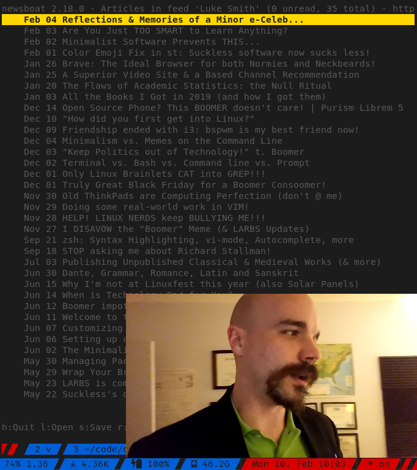
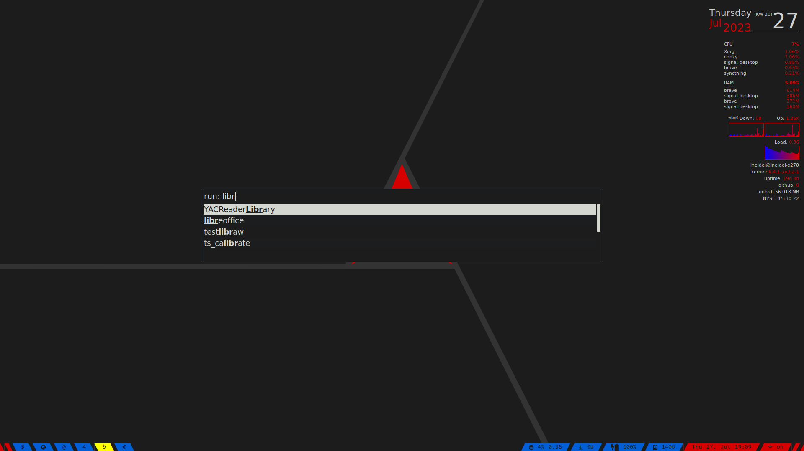

# dotfiles

> My arch linux setup and beyond

See [the repo directoy](repo/#readme) for how these dotfiles are managed.

To see updates you can watch the Github releases, where I will regularly
document the changes that I've done.

<!-- big screenshots here -->

## Table of Contents
<!-- START doctoc generated TOC please keep comment here to allow auto update -->
<!-- DON'T EDIT THIS SECTION, INSTEAD RE-RUN doctoc TO UPDATE -->

- [Terminal apps](#terminal-apps)
  - [zsh (shell)](#zsh-shell)
  - [tmux (terminal mutiplexer)](#tmux-terminal-mutiplexer)
  - [neovim (terminal editor)](#neovim-terminal-editor)
  - [git (version control)](#git-version-control)
  - [mpd + ncmpcpp (music player)](#mpd--ncmpcpp-music-player)
  - [remind (calendar)](#remind-calendar)
- [GUI apps](#gui-apps)
  - [kitty (terminal)](#kitty-terminal)
  - [mpv (video/audio player)](#mpv-videoaudio-player)
  - [rofi (application launcher/dmenu)](#rofi-application-launcherdmenu)
  - [brave (browser)](#brave-browser)
  - [signal (messaging)](#signal-messaging)
- [System apps](#system-apps)
  - [sxhkd (hotkey daemon)](#sxhkd-hotkey-daemon)
  - [i3 (window manager)](#i3-window-manager)
  - [lock screen](#lock-screen)
- [Browser Extensions](#browser-extensions)
  - [Required](#required)
  - [Useful](#useful)
  - [Privacy](#privacy)
  - [Maybe](#maybe)
- [Android apps](#android-apps)
- [MacOS](#macos)

<!-- END doctoc generated TOC please keep comment here to allow auto update -->

## Terminal apps

### zsh (shell)

Superior shell, extends bash/posix.

I'm using a stripped down version of
[oh-my-zsh](https://github.com/robbyrussell/oh-my-zsh) with a lot of custom
aliases.

- [main config](.zshrc)
- [secondary configs, aliases](.zsh)
- [theme](.zsh/cobalt2.zsh-theme)

### tmux (terminal mutiplexer)

Multiple shells within the same terminal, screen splitting and [much more](https://github.com/tmux/tmux/wiki).

- [main config](.config/tmux/tmux.conf)
- [scripts](scripts/tmux)
- [terminfo](.config/tmux/tmux-256color.terminfo)


To supports italic fonts, enable the terminal capabilities with:

```sh
tic -x .config/tmux/tmux-256color.terminfo
```

### neovim (terminal editor)

Neovim with custom macros, hooks and a few plugins.

- [config entrypoint](.config/nvim)


<!--### Eslint (js linter)

[View eslint config](https://raw.githubusercontent.com/jneidel/dotfiles/master/.eslintrc) - `~/.eslintrc`
[View eslint typescript config](https://raw.githubusercontent.com/jneidel/dotfiles/master/.eslintrc-ts) - `~/.eslintrc-ts`

Once globally installed, run anywhere:

```zsh
# for js
eslint --fix .

# for ts
eslint -c ~/.eslintrc-ts --fix .
```

See [eslint aliases](https://github.com/jneidel/dotfiles/blob/master/manjaro/.zsh/eslint.zsh) for shortcuts.

Requires eslint, as well as a few plugins to be installed globally:

```zsh
# for js
npm i -g eslint eslint-plugin-node eslint-plugin-unicorn eslint-plugin-json eslint-plugin-xo eslint-config-xo

# for js & ts
npm i -g eslint eslint-plugin-node eslint-plugin-unicorn eslint-plugin-json eslint-plugin-xo eslint-config-xo eslint-config-xo-typescript @typescript-eslint/parser @typescript-eslint/eslint-plugin
```

For an easy start into eslint try [eslint-nibble](https://github.com/IanVS/eslint-nibble).
-->

### git (version control)

- [global config](.config/git/config)
- [global gitignore](.config/git/ignore)

### mpd + ncmpcpp (music player)

Music player daemon and its client.

- [my music setup in detail](docs/music.md)
- [mpd config](.config/mpd/mpd.conf)
- [ncmpcpp configs](.config/ncmpcpp)


### remind (calendar)

`remind` is not a classical calendar application. I've tried [calcurse](https://calcurse.org/) and
[khal](https://github.com/pimutils/khal#khal) but they were trying to emulate
normal GUI calendars too much and were imo just loosing in comparison.
`remind` does it's own thing. It's a powerful DSL (domain specific language)
where you define all of your entries in a text file. With this approach you can model
some very sophisticated recurring entries like you've never seen before.

```remind
# simple stuff:
Oct 01 MSG Change car tires
REM [TRIGGER(easter)] MSG Change car tires

# with colors for birthdays
REM Feb 7 SPECIAL COLOR 205 0 255 BD Francis

# appointments with start and end time (via DURATION in min)
Thu AT 17:30 DURATION 90 SPECIAL COLOR 215 0 0 Rendezvous mit meinem Geld

# more complex stuff:
# taking out the trash every 14 days
# but only show me 3 days in advance
# and hide the entry if it's in the past
REM 2021-05-17 *14 AFTER SATISFY [trigdate() < realtoday()+3 && trigdate() >= realtoday()] SPECIAL COLOR 140 100 40 Plastikmüll rausstellen
REM 2021-05-18 *14 AFTER SATISFY [trigdate() < realtoday()+3 && trigdate() >= realtoday()] SPECIAL COLOR 140 100 40 Restmüll rausstellen
# these will take into account any holidays you have configured
OMIT Oct 3 SPECIAL COLOR 175 175 25 Tag der Deutschen Einheit
# and push back garbage day to the day AFTER
```

- [Offical website](https://dianne.skoll.ca/projects/remind)
- [aliases](.zsh/apps/remind.zsh)


## GUI apps
### kitty (terminal)

Fast, easy to configure, batteries included.

- [main config](.config/kitty/kitty.conf)
- [main colorscheme](.config/kitty/jneidel-colors.conf)
- see directory for [light setup](.config/kitty)

### mpv (video/audio player)

Everything you'll ever need from a video player.

- [config](.config/mpv/mpv.conf)
- [keybindings](.config/mpv/input.conf)
- [scripts](scripts/mpv)



### rofi (application launcher/dmenu)

- [config](.config/rofi/config.rasi)
- [arc-dark colorscheme](.config/rofi/arc-dark.rasi)
- [scripts](scripts/rofi)



### brave (browser)

- [extensions](#browser-extensions)
- [color scheme](https://chrome.google.com/webstore/detail/arc-dark/adicoenigffoolephelklheejpcpoolk)

<details>
<summary>Manual Config</summary>

**Disallow sites to ask if they can send notifications**

Looking at you reddit...

Search "Content" -> "Site and Shield Settings" -> "Notifications" -> Toggle

</details>

### signal (messaging)

Secure messaging.

**signal-desktop**

My preferred way to use Signal.

Notifications use [dunst](#dunst) (notification daemon).

- [keyboard shortcuts](https://support.signal.org/hc/en-us/articles/360036517511-Signal-Desktop-Keyboard-Shortcuts)

**signal-cli**

Runs on my server under a different phone number to send (cron scheduled)
messages to myself.

Example use case: cut down todays meal plan into one simple image and send it to
myself just before lunch time (only on days when I'm in school of course)
[see](scripts/htw/send-mensa-plan).

- [scripts](scripts/signal)

## System apps
### sxhkd (hotkey daemon)

The essential hotkey daemon.

- [config](.config/sxhkd/sxhkdrc)

### i3 (window manager)

Lightweight window manager.

- [config](.config/i3/config)

### lock screen

i3lock with a custom screenshot script.

- [script](scripts/i3/lock/lock)


## Browser Extensions

**Theme:**
I use **Arc Dark** as I based my terminal colorscheme on it.
[firefox](https://addons.mozilla.org/en-US/firefox/addon/arc-dark-theme-we/)
[chrome](https://chrome.google.com/webstore/detail/arc-dark/adicoenigffoolephelklheejpcpoolk)

### Required

| name | description | links |
|--|--|--|
| uBlock Origin | Best free (as in freedom) adblocker | [firefox](https://addons.mozilla.org/en-US/firefox/addon/ublock-origin/) [chrome](https://chrome.google.com/webstore/detail/cjpalhdlnbpafiamejdnhcphjbkeiagm) [git](https://github.com/gorhill/uBlock) |
| Surfing Keys | Navigate browser with vim shortcuts | [firefox](https://addons.mozilla.org/en-US/firefox/addon/surfingkeys_ff/) [chrome](https://chrome.google.com/webstore/detail/surfingkeys/gfbliohnnapiefjpjlpjnehglfpaknnc) [git](https://github.com/brookhong/Surfingkeys) [simpler-alternative](https://github.com/philc/vimium) |
| Dark Reader | Dark mode for all websites | [firefox](https://addons.mozilla.org/en-US/firefox/addon/darkreader) [chrome](https://chrome.google.com/webstore/detail/dark-reader/eimadpbcbfnmbkopoojfekhnkhdbieeh) [git](https://github.com/darkreader/darkreader) |
| KeePassXC-Browser | KeePass integration for password insert | [firefox](https://addons.mozilla.org/en-US/firefox/addon/keepassxc-browser/) [chrome](https://chrome.google.com/webstore/detail/keepassxc-browser/oboonakemofpalcgghocfoadofidjkkk) [git](https://github.com/keepassxreboot/keepassxc-browser) [setup on iridium](https://github.com/keepassxreboot/keepassxc/issues/1559#issuecomment-369732493) |

### Useful

| name | description | links |
|--|--|--|
| SponsorBlock for YouTube | Skip sponsor/recap/like comment subscribe segments in videos | [firefox](https://addons.mozilla.org/en-US/firefox/addon/sponsorblock/) [chrome](https://chrome.google.com/webstore/detail/sponsorblock-for-youtube/mnjggcdmjocbbbhaepdhchncahnbgone) [my options](images/sponsor-block-options.png) |
| FastForward | Skip link shorteners | [firefox](https://github.com/FastForwardTeam/FastForward/blob/main/INSTALLING.md#firefox-based-browsers-firefox-waterfox-pale-moon-librewolf-etc) [chrome](https://github.com/FastForwardTeam/FastForward/blob/main/INSTALLING.md#chromium-based-browsers-chrome-kiwi-opera-opera-gx-vivaldi-brave-etc) [git](https://github.com/FastForwardTeam/FastForward) |
| I still don't care about cookies | Ignore cookie banners | [firefox](https://addons.mozilla.org/en-US/firefox/addon/istilldontcareaboutcookies/) [chrome](https://chrome.google.com/webstore/detail/i-still-dont-care-about-c/edibdbjcniadpccecjdfdjjppcpchdlm) [git](https://github.com/OhMyGuus/I-Still-Dont-Care-About-Cookies) |
| Libredirect | Redirect to libre version of popular website | [firefox](https://addons.mozilla.org/firefox/addon/libredirect/) [chrome](https://libredirect.github.io/download_chromium.html) [git](https://github.com/libredirect/libredirect) |
| Bypass Paywalls | Ignore e.g. NYTs free articles limiter | [git](https://gitlab.com/magnolia1234/bypass-paywalls-chrome-clean) |
| Easy to RSS | List the rss feeds of the current site | [firefox](https://addons.mozilla.org/en-GB/firefox/addon/easy-to-rss/) [chrome](https://chrome.google.com/webstore/detail/easy-to-rss/hbcmpkcpbnecinpngdnfbnknfkdpdfli) [git](https://github.com/idealclover/Easy-to-RSS) |
| Autofill | Automatically fill forms with configured data | [chrome](https://chrome.google.com/webstore/detail/autofill/nlmmgnhgdeffjkdckmikfpnddkbbfkkk) |

### Privacy

| name | description | links |
|--|--|--|
| Privacy Badger | Stop suspicious trackers | [firefox](https://addons.mozilla.org/en-US/firefox/addon/privacy-badger17/) [chrome](https://chrome.google.com/webstore/detail/privacy-badger/pkehgijcmpdhfbdbbnkijodmdjhbjlgp) [git](https://github.com/EFForg/privacybadger) |
| ClearURLs | Remove tracking elements from urls | [firefox](https://addons.mozilla.org/firefox/addon/clearurls/) [chrome](https://chrome.google.com/webstore/detail/clearurls/lckanjgmijmafbedllaakclkaicjfmnk) [git](https://gitlab.com/KevinRoebert/ClearUrls) |
| LocalCDN | Stop tracking through CDNs by redirecting to local resources | [chrome](https://chrome.google.com/webstore/detail/localcdn/njdfdhgcmkocbgbhcioffdbicglldapd) |
| Decentraleyes | Stop tracking through CDNs | [firefox](https://addons.mozilla.org/en-US/firefox/addon/decentraleyes) [chrome](https://chrome.google.com/webstore/detail/decentraleyes/ldpochfccmkkmhdbclfhpagapcfdljkj) [git](https://git.synz.io/Synzvato/decentraleyes) |

### Maybe

| name | description | links |
|--|--|--|
| Buster | Captcha Solver | [firefox](https://addons.mozilla.org/en-US/firefox/addon/buster-captcha-solver/) [chrome](https://chrome.google.com/webstore/detail/mpbjkejclgfgadiemmefgebjfooflfhl) [git](https://github.com/dessant/buster) |
| Hover Zoom+ | Large overlay on image and link to image hover | [chrome](https://chrome.google.com/webstore/detail/hover-zoom%20/pccckmaobkjjboncdfnnofkonhgpceea) [git](https://github.com/extesy/hoverzoom/) |
| Stylus | Customize website style | [firefox](https://addons.mozilla.org/firefox/addon/styl-us/) [chrome](https://chrome.google.com/webstore/detail/stylus/clngdbkpkpeebahjckkjfobafhncgmne) [git](https://github.com/openstyles/stylus) |

<details>
<summary><strong>Coding:</strong></summary>

<!-- Brave is my browser for web-development. -->

| name | description | links |
|--|--|--|
| Chrome Markdown Preview | Elegant GFM preview on `.md` files | [chrome](https://chrome.google.com/webstore/detail/chrome-markdown-preview/ghmocdlbmpcchcbkkingnkgemjacgfdf) [git](https://github.com/zce/chrome-markdown) |
| JSON Formatter | Easy to read JSON formatting | [chrome](https://chrome.google.com/webstore/detail/json-formatter/bcjindcccaagfpapjjmafapmmgkkhgoa) [git](https://github.com/callumlocke/json-formatter) |
| Modify Header Value | Set HTTP headers | [firefox](https://addons.mozilla.org/en-US/firefox/addon/modify-header-value) [chrome](https://chrome.google.com/webstore/detail/modify-header-value-http/cbdibdfhahmknbkkojljfncpnhmacdek) [homepage](https://mybrowseraddon.com/modify-header-value.html) |

<details>
<summary><strong>GitHub related plugins</strong></summary>

A comprehensive list of GitHub chrome extensions can be found [here](https://github.com/stefanbuck/awesome-browser-extensions-for-github).

| name | description | links |
|--|--|--|
| Refined GitHub | GitHub functional/visual upgrade | [chrome](https://chrome.google.com/webstore/detail/refined-github/hlepfoohegkhhmjieoechaddaejaokhf) [git](https://github.com/sindresorhus/refined-github) |
| npmhub | List npm dependencies in readme | [chrome](https://chrome.google.com/webstore/detail/npmhub/kbbbjimdjbjclaebffknlabpogocablj) [git](https://github.com/npmhub/npmhub) |
| Octotree | GitHub file tree | [chrome](https://chrome.google.com/webstore/detail/octotree/bkhaagjahfmjljalopjnoealnfndnagc) [git](https://github.com/buunguyen/octotree/) |
| Vscode-icons | Icons indicating file type | [chrome](https://chrome.google.com/webstore/detail/github-vscode-icons/hoccpcefjcgnabbmojbfoflggkecmpgd) [git](https://github.com/dderevjanik/github-vscode-icons) |
| Lovely Forks | Shows notable forks | [chrome](https://chrome.google.com/webstore/detail/lovely-forks/ialbpcipalajnakfondkflpkagbkdoib) [git](https://github.com/musically-ut/lovely-forks) |
| npm-stats | Display npm download stats in repo | [chrome](https://chrome.google.com/webstore/detail/github-npm-stats/oomfflokggoffaiagenekchfnpighcef) [git](https://github.com/katranci/github-npm-stats) |
| show-email | Display email on profile, even if not provided | [chrome](https://chrome.google.com/webstore/detail/github-show-email/pndebicblkfcinlcedagfhjfkkkecibn) [git](https://github.com/prabhakar267/github-email-extractor) |
| omnibar | Shortcut navigation for github | [chrome](https://chrome.google.com/webstore/detail/github-omnibar/njccjmmakcbdpnlbodllfgiloenfpocb/related?utm_source=chrome-ntp-icon) [git](https://github.com/jcouyang/gh-omnibar) |
| issue-link-status | Colorize issue links depending on status | [chrome](https://chrome.google.com/webstore/detail/github-issue-link-status/nbiddhncecgemgccalnoanpnenalmkic) [git](https://github.com/bfred-it/github-issue-link-status/) |
| build-tabs | Build tab for github | [chrome](https://chrome.google.com/webstore/detail/builds-tab-for-github/jnmdkbflmkjehkkdbjdfpmhgdafpcdkh) [git](https://github.com/duxet/builds-tab) |
| github-autocomplete | Github search autocomplete | [chrome](https://chrome.google.com/webstore/detail/awesome-autocomplete-for/djkfdjpoelphhdclfjhnffmnlnoknfnd) [git](https://github.com/algolia/github-awesome-autocomplete) |
| github-plus | Display repo size, download links | [chrome](https://chrome.google.com/webstore/detail/github-plus/anlikcnbgdeidpacdbdljnabclhahhmd) [git](https://github.com/softvar/github-plus) |

</details><br/>
</details>

<!-- | name | description | links | -->
<!-- |--|--|--| -->
<!-- | Disable WebRTC | Stop IP leakage while using a VPN | [firefox](https://addons.mozilla.org/en-US/firefox/addon/happy-bonobo-disable-webrtc/) | -->
<!-- | Chameleon | Easily spoof user-agents & more | [firefox](https://addons.mozilla.org/en-US/firefox/addon/chameleon-ext/) [git](https://github.com/sereneblue/chameleon) | -->
<!-- | Dict.cc Translation | Quick translations | [firefox](https://addons.mozilla.org/firefox/addon/dictcc-translation/) [git](https://github.com/Lusito/dict.cc-translation) | -->
<!-- | Block Site | Block domains in the browser | [chrome](https://chrome.google.com/webstore/detail/block-site/nkedbnokglppcmiencngilkkhhnpcfjb) | -->
<!-- | StayFocusd | Site blocker, limit black list to given time | [chrome](https://chrome.google.com/webstore/detail/stayfocusd/laankejkbhbdhmipfmgcngdelahlfoji) | -->

## Android apps

F-Droid is a software repository hosting free and (mostly) open source apps. If
available always try to use F-Droid over the google play store. Read more on
[F-Droid](https://f-droid.org/). Most fdroid apps are also on gplay, even if I
did not include them here.

If you need the google play store you can use [Aurora](https://auroraoss.com/)
instead. It's an alternative play store interface, allowing for private
downloads and a better UI.

Ordered by importance.

| name | description | links |
|--|--|--|
| Signal | Privacy friendly messaging, end to end encrypted chat | [gplay](https://play.google.com/store/apps/details?id=org.thoughtcrime.securesms) [git](https://github.com/signalapp/Signal-Android) [website](https://www.signal.org/) |
| Öffi | Public transport planning | [fdroid](https://f-droid.org/en/packages/de.schildbach.oeffi/) |
| f.lux | Bluelight filter (root) | [gplay](https://play.google.com/store/apps/details?id=com.justgetflux.flux) [website](https://justgetflux.com/) |
| Vinyl | Full featured music player | [fdroid](https://f-droid.org/packages/com.poupa.vinylmusicplayer/) [gplay](https://play.google.com/store/apps/details?id=com.poupa.vinylmusicplayer) [git](https://github.com/AdrienPoupa/VinylMusicPlayer) |
| primitive ftpd | ftp server | [fdroid](https://f-droid.org/en/packages/org.primftpd/) [git](https://github.com/wolpi/prim-ftpd) |
| OI Shopping List | Shopping list | [fdroid](https://f-droid.org/packages/org.openintents.shopping) |
| K-9 Mail | Mail | [fdroid](https://f-droid.org/en/packages/com.fsck.k9) [sync-setup](https://github.com/k9mail/k-9/issues/857#issuecomment-397109350) |
| AudioAnchor | Audiobook player | [fdroid](https://f-droid.org/packages/com.prangesoftwaresolutions.audioanchor/) |
| NewPipe SponsorBlock | Youtube with adblock capabilities | [apk](https://github.com/polymorphicshade/NewPipe/releases) [git](https://github.com/polymorphicshade/NewPipe) |
| dict.cc | Offline dictionary | [gplay](https://play.google.com/store/apps/details?id=cc.dict.dictcc) |
| M.A.L.P. | MPD client | [fdroid](https://f-droid.org/en/packages/org.gateshipone.malp) |
| FBReader | Ebook reader | [fdroid](https://f-droid.org/packages/org.geometerplus.zlibrary.ui.android/) [gplay](https://play.google.com/store/apps/details?id=org.geometerplus.zlibrary.ui.android&referrer=utm_source%3Dfbreader.org%26utm_medium%3Dbadge%26utm_content%3Dandroid-page-bottom%26utm_campaign%3Dbadge) [git](https://github.com/geometer/FBReaderJ) |
| DuckDuckGo | Browser | [fdroid](https://f-droid.org/en/packages/com.duckduckgo.mobile.android/) |
| CamScanner | Document scanner | [gplay](https://play.google.com/store/apps/details?id=com.intsig.camscanner) |
| OsmAnd | Navigation | [fdroid](https://f-droid.org/packages/net.osmand.plus/) [gplay](https://play.google.com/store/apps/details?id=net.osmand) |
| KeePass DX | Mobile keepass database | [fdroid](https://f-droid.org/en/packages/com.kunzisoft.keepass.libre) |
| MuPDF | PDF viewer | [fdroid](https://f-droid.org/en/packages/com.artifex.mupdf.viewer.app) |
| Markor | Markdown editor, notes app | [fdroid](https://f-droid.org/en/packages/net.gsantner.markor/) [gplay](https://play.google.com/store/apps/details?id=net.gsantner.markor) [git](https://github.com/gsantner/markor) |
| Anki | Flashcards | [fdroid](https://f-droid.org/en/packages/com.ichi2.anki/) [gplay](https://play.google.com/store/apps/details?id=com.ichi2.anki) [git](https://github.com/ankidroid/Anki-Android) |
| DAVx⁵ | CalDAV sync | [fdroid](https://f-droid.org/packages/at.bitfire.davdroid/) [website](https://www.davx5.com) [setup explaination](docs/caldav.md) |
| HiPER Calc | Superior calculator | [gplay](https://play.google.com/store/apps/details?id=cz.hipercalc.pro) |
| Productivity Challenge Timer | Optimized pomodoro clock | [gplay](https://play.google.com/store/apps/details?id=com.wlxd.pomochallenge) |
| Micopi+ | Generate profile picture for contacts | [fdroid](https://f-droid.org/en/packages/com.easytarget.micopi) |
| DNS66 | Mobile hosts file | [fdroid](https://f-droid.org/en/packages/org.jak_linux.dns66) |
| Termux | Terminal emulator | [fdroid](https://f-droid.org/en/packages/com.termux/) [git](https://github.com/termux/termux-app) |
| MX Player | Video player (better than vlc) | [gplay](https://play.google.com/store/apps/details?id=com.mxtech.videoplayer.pro) |

<details>
<summary><strong>Maybes (not in current use)</strong></summary>

| name | description | links |
|--|--|--|
| p!n | Pin notes as notifications | [fdroid](https://f-droid.org/en/packages/de.nproth.pin/) [git](https://github.com/nproth/pin) |
| Simple Calendar | Calendar | [fdroid](https://f-droid.org/packages/com.simplemobiletools.calendar.pro/) [git](https://github.com/SimpleMobileTools/Simple-Calendar) |
| My Expenses | Expense/income tracker, with exports | [fdroid](https://f-droid.org/repository/browse/?fdid=org.totschnig.myexpenses) [gplay](https://play.google.com/store/apps/details?id=org.totschnig.myexpenses) [git](https://github.com/mtotschnig/MyExpenses) |
| Time Meter | Smooth time tracker, with exports | [gplay](https://play.google.com/store/apps/details?id=com.rk.timemeter) |
| JuiceSSH | Mobile mosh (ssh) client | [fdroid](https://play.google.com/store/apps/details?id=com.sonelli.juicessh) |
| Macros | Calorie Counter | [gplay](https://play.google.com/store/apps/details?id=com.josmantek.macros) |
| Relaxio | White-noise player | [gplay](https://play.google.com/store/apps/details?id=net.relaxio.relaxio) |
| Amaze | File manager | [fdroid](https://f-droid.org/packages/com.amaze.filemanager/) [git](https://github.com/TeamAmaze/AmazeFileManager) |
| Alarmio | Alarm clock, timer | [fdroid](https://f-droid.org/en/packages/me.jfenn.alarmio/) [git](https://github.com/fennifith/Alarmio) |
| StreetComplete | Simplified OSM contribution | [fdroid](https://f-droid.org/en/packages/de.westnordost.streetcomplete) |
| Dicer | Roll dices | [fdroid](https://f-droid.org/en/packages/org.secuso.privacyfriendlydicer) |
| Tape Measure | Measure distances in an image | [fdroid](https://f-droid.org/en/packages/org.secuso.privacyfriendlytapemeasure) |
| Voice | Audiobook player (more formats than audiopo, but inferior interface) | [fdroid](https://f-droid.org/en/packages/de.ph1b.audiobook) |
| Scrambled Exif | Remove metadata from images before sharing them | [fdroid](https://f-droid.org/en/packages/com.jarsilio.android.scrambledeggsif) |
| MPDroid | Alternative MPD client | [fdroid](https://f-droid.org/en/packages/com.namelessdev.mpdroid) |
| Bluelight Filter | Filters the bluelight, easier on the eyes, set filter based on time | [gplay](https://play.google.com/store/apps/details?id=jp.ne.hardyinfinity.bluelightfilter.free) |
| Vespucci | OSM Editor | [fdroid](https://f-droid.org/en/packages/de.blau.android) |

</details>

## MacOS

My OSX install is no longer maintained, but you can still [explore the files here](https://github.com/jneidel/dotfiles/tree/bd758ada365a9fc2e7d4dc0b456684cfe88dc2bd/osx).

