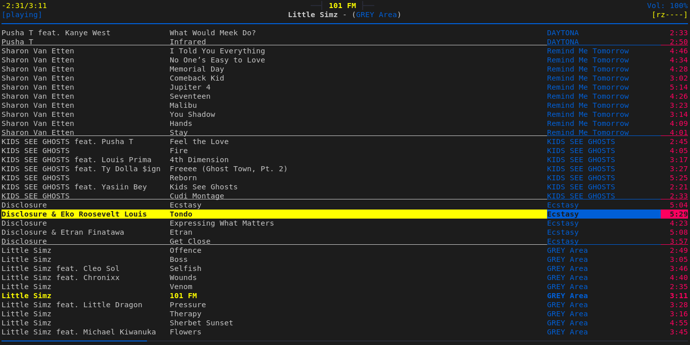

# Music Setup Guide

A comprehensive rundown of my setup in regards to music.

**Table of Contents:**

<!-- toc -->

- [1. Background](#1-background)
  * [1.1 Short description](#11-short-description)
  * [1.2 My needs; A comparison to Spotify](#12-my-needs-a-comparison-to-spotify)
  * [MP3 vs FLAC](#mp3-vs-flac)
- [2. Retrival](#2-retrival)
  * [2.1 Bandcamp](#21-bandcamp)
  * [2.2 Torrents](#22-torrents)
  * [2.3 Soundcloud](#23-soundcloud)
    + [2.3.1 Paywalled: Real-debrid](#231-paywalled-real-debrid)
  * [2.4 YouTube](#24-youtube)
  * [2.5 German forum](#25-german-forum)
- [3. Tagging](#3-tagging)
  * [3.1 Preparation](#31-preparation)
  * [3.2 Tagging](#32-tagging)
    + [3.2.1 Automatic: beets](#321-automatic-beets)
    + [3.2.2 Semi-automatic: script](#322-semi-automatic-script)
    + [3.2.3 Scripting: eyeD3](#323-scripting-eyed3)
    + [3.2.4 Manual: kid3](#324-manual-kid3)
  * [3.3 Cleanup](#33-cleanup)
- [4. Listening](#4-listening)
  * [4.1 Computer: mpd + ncmpcpp](#41-computer-mpd--ncmpcpp)
  * [4.2 Phone: Vinyl](#42-phone-vinyl)
- [5. Auxiliary](#5-auxiliary)
  * [5.1 Stucture](#51-stucture)
  * [5.2 Transmission](#52-transmission)
  * [5.3 Backups](#53-backups)

<!-- tocstop -->

## 1. Background
### 1.1 Short description

All music that I listen to is stored as mp3 files, fully tagged with covers and
lyrics, with systems in place for adding new material from various sources,
managing, transmitting and backing up existing music.

### 1.2 My needs; A comparison to Spotify

A comparison to why Spotify would not work for me draws out what my needs toward
a music setup are.
As a disclaimer, I haven't used Spotify for any length of time, so my view of
what it is might not be wholly acurate (but sufficient to get my point across).

**Offline access:**

All my other primary modes of media (movies/series/anime, comics/manga,
podcasts, youtube even) I have systems for engaging with them offline.
Offline access brings with it a host of advantages:

- independent of internet speed (I'm not used to always having a stable
connection)
- uses a consistent interface
([mpv](https://github.com/mpv-player/mpv) for video,
[YACReader](https://github.com/YACReader/yacreader) for comics)
- is configurable to the way I use it
- always accessible

Spotify can also download music, but at that point managing what downloaded in
the app is not really easier that managing my mp3s.

**Licensing/Control:**

Not all music is on Spotify. And that is just not something I can accept.

And even the stuff that is on Spotify is not guaranteed to stay there (compare
with Netflix where stuff regularly disappears because of licensing issues).
I want to be in control of my music. And using Spotify I wouldn't be.

**Convenience:**

I think it compares pretty well to Arch Linux vs. Windows/MacOS.
Sure, figuring out Arch Linux and setting up my perfect system took a lot of
time. But after having set it up my system is extremely stable. To the point
where in the last 1.5 years I only had like 3h of combined need to service the
system. Because I have understood my system I can solve what crops up without
frustration. All other systems I had before: Windows, MacOS and even Manjaro
always had some annoyances wearing me down. They could not fit me, because they
were not made to fit me and change within them was limited.

So you either spend the time upfront in building the perfect system for you.
Or you use something built for the general population that will for fit your
needs and spend even more time with the quirks of a system not designed for you.

Thats how I feel about Spotify as well.

**Libary management:**

Most albums I don't leave as they originally are. I delete songs and I cut off
intros/outros, skits and blank space where it annoys me. I make the music my
own. Spotify does not allow me to mess with MY music.

### MP3 vs FLAC

I don't hear the difference. Yeah I know bad hearing, get better headphones,
blablabla. That point does not matter to me.

What does is size, tooling and availability.

Differences in disk space is significant if applied to the whole collection.
Especially on a 250gb ssd.

Mp3 has all the tooling available, most of it supports flac as well but I would
not count on it. It's just gonna be harder.

Good luck searching for everything as flacs. Many projects are available but
never all of them (think soundcloud rappers). So now you are maintaining two
stacks: flacs as a primary and mp3 as a backup. Complicates everything.
Whereas flac can always be downgraded to mp3s. So even if only flacs are
available, that is still an advantage for mp3s.

## 2. Retrival

You can almost always get music by paying for it. This section is concerned with
acquiring it without the paying-part.

Now follows a elaborating of possible sources. Ordered by my preference.

### 2.1 Bandcamp

**What is available:** independent, minor label stuff

I always use bandcamp if possible. The only place I buy music from.

To download: [bandcamp-dl](https://github.com/iheanyi/bandcamp-dl)

### 2.2 Torrents

**What is available:** popular, major label stuff; whole discographies

Sites to check:
- [1337x](https://1337x.to/)
- [tpb](https://pirate-proxy.me/)
- [Find proxies, if those instances down](https://unblockit.tv/)

To download:
- [transmission-cli](https://transmissionbt.com) (torrent client)
- [see aliases](../.zsh/transmission.zsh)
- [see scripts](../scripts/transmission)
- [transmission TUI](https://github.com/tremc/tremc) (alternative frontend)

### 2.3 Soundcloud

**What is available:** wide range; pretty much all major label releases; huge back-catalog

If the album is not behing a paywall you can just download it with
[youtube-dl](https://github.com/ytdl-org/youtube-dl).

My [alias](../.zsh/apps.zsh):

```sh
alias ytmp3="youtube-dl --yes-playlist -c -i --retries 4 -x --audio-format 'mp3' --audio-quality '320K' -o '~/Downloads/%(title)s.%(ext)s' --embed-thumbnail"
```

#### 2.3.1 Paywalled: Real-debrid

The paywal makes things a bit trickier. After some looking I found a solution
that works for me: [real-debrid](http://real-debrid.com/?id=3301710).
You pay 3€ (15 days account) to circumvent their GO+ crap by downloading the stuff
through their service.
To make the most use of this I keep a file where I gather the paywalled links
for albums I want to get and then download them all at once after buying a
premium account.

- [sc2rd script](../scripts/music/sc2rd) - to automate the process of converting
the soundcloud links to downloadable real-debrid links

### 2.4 YouTube

**What is available:** almost everything; inconsistent quality and sometimes
incomplete

I avoid this where ever I can, because these YouTube playlists for albums are
mostly uploaded by randoms, so you can't trust that they are complete (you have
to double-check with the album on wikipedia) and the quality can be a mixed bag
as well. It's just not clear what you are getting, with all other sources, if
they have it, then it's smooth sailing. YouTube just involves the most manual
labor.


Again to download:

- [youtube-dl](https://github.com/ytdl-org/youtube-dl).
- [aliases](../.zsh/apps.zsh):

```sh
alias ytmp3="youtube-dl --yes-playlist -c -i --retries 4 -x --audio-format 'mp3' --audio-quality '320K' -o '~/Downloads/%(title)s.%(ext)s' --embed-thumbnail"
```


### 2.5 German forum

**What is available:** recent, german stuff

For german releases you can find stuff here that is not available elsewhere. But
the time window is pretty short, like up to 2 years after release (not a hard rule).

- [forum](https://mygully.com/)
- for mass downloads also use [real-debrid](http://real-debrid.com/?id=3301710)
(there are heavy speed limiters)

## 3. Tagging
### 3.1 Preparation

- [tomp3](../scripts/music/tomp3) - convert non mp3 music to mp3s

### 3.2 Tagging

The act of correctly assigning artist, album, track numbers and other data to
the mp3s.

Ordered in preference.

#### 3.2.1 Automatic: beets

For for everything released by a label (almost everything). Uses the huge
[MusicBrainz](https://musicbrainz.org) database.

Tags automatically (user only confirms) including covers & lyrics and moves
renames the files and puts the in the correct structure.

- import script: [beetim](../scripts/music/beetim)
- [beets](https://github.com/beetbox/beets)
- [beets config](../.config/beets/config.yaml) (everything incl. cover & lyrics)
- [beets docs](https://beets.readthedocs.io/en/stable)
- check [apps](../apps) for beets plugin dependencies

#### 3.2.2 Semi-automatic: script

For those instances where what you want to tag is not in the MusicBrainz db,
something you just pulled off of Soundcloud, a random Single and the like.

The script read artist and title from the filename. Album artist and album name
can be supplemented by the user.

- [tag-single](../scripts/music/tag-single):

```sh
# usage (refer to script --help for more)
tag-single *.mp3
tag-single -A "Black Muffin" *.mp3
tag-single -AA "Black Muffin" "Totem" *.mp3
```

#### 3.2.3 Scripting: eyeD3

Powerful cli for messing with id3 tags.

- [eyeD3](https://github.com/nicfit/eyeD3)
- [scripts](../.zsh/mp3-tagging.zsh)

#### 3.2.4 Manual: kid3

GUI for fixing small stuff.

What I use it for: Adding covers is easy. Renaming based on tag values. Just
quickly checking tag contents.

- [kid3](https://kid3.sourceforge.io)

### 3.3 Cleanup

- [fix-mp3-dates](../scripts/music/fix-mp3-dates) - to me only the release year
matters (not the month and date), this script fixes that
- [mcut](../scripts/music/mcut) - cut parts off a file

## 4. Listening
### 4.1 Computer: mpd + ncmpcpp

I'm using the gold standard: mpd + ncmpcpp.
`mpd` is a server and `ncmpcpp` the corresponding frontend client.
An awesome, scriptable and configurable TUI.



- [Video Introduction (Luke Smith)](https://www.youtube.com/watch?v=sZIEdI9TS2U)
- arch wiki: [mpd](https://wiki.archlinux.org/index.php/Music_Player_Daemon), [ncmpcpp](https://wiki.archlinux.org/index.php/Ncmpcpp)
- [mpd config](../.config/mpd/mpd.conf)
- [ncmpcpp configs](../.config/ncmpcpp)
- [scripts](../scripts/mpd)
- [control mpd via keybindings](../scripts/sxhkd/control-mpd)

### 4.2 Phone: Vinyl

Clean player that does everything I need.
This is a matter of preference and there are plenty to choose from.

- [vinyl](https://github.com/AdrienPoupa/VinylMusicPlayer)
- [f-droid](https://f-droid.org/en/packages/com.poupa.vinylmusicplayer/)

## 5. Auxiliary

Less important supplemental information.

### 5.1 Stucture

I split my music between:

1. Stuff I'm actively listening to

In the process of being judged.

It's at the top level of the `music` directory.

2. Stuff that I decided to keep

Bad track have been weeded out, annoying passages cut. These are the bangers I
want to continue listening to.

To make place for newer stuff with the next backup I'll be removing them from my
local machine, as such the are in the directory `music/_tomove`.

To mark an album as complete: [`$ amv`](../scripts/music/amv)

3. Stuff that I have not listend to

Contained in `music/unheard`.

To move an album out of unheard: [`$ amv -u`](../scripts/music/amv)

4. Stuff that has just been tagged

The beets tagging writtes it's results to `music/_imported` to be checked before
manually being added to unheard.

### 5.2 Transmission

To get my music on my phones I use ftp.

It's as easy as installing an [ftp
server](https://f-droid.org/en/packages/org.primftpd/) on the phone and logging
in from the command-line using `$ sftp -P PORT IP`.

- [ftp script](../scripts/ftp/ftpp) - remember ip addresses depending on network

### 5.3 Backups

Irregularly I backup on a 128gb usb stick and my external drive.
This can be done efficiently using rsync:

```sh
rsync -avr LOCAL/ REMOTE
```

- [sync-music script](../scripts/music/sync-music)

