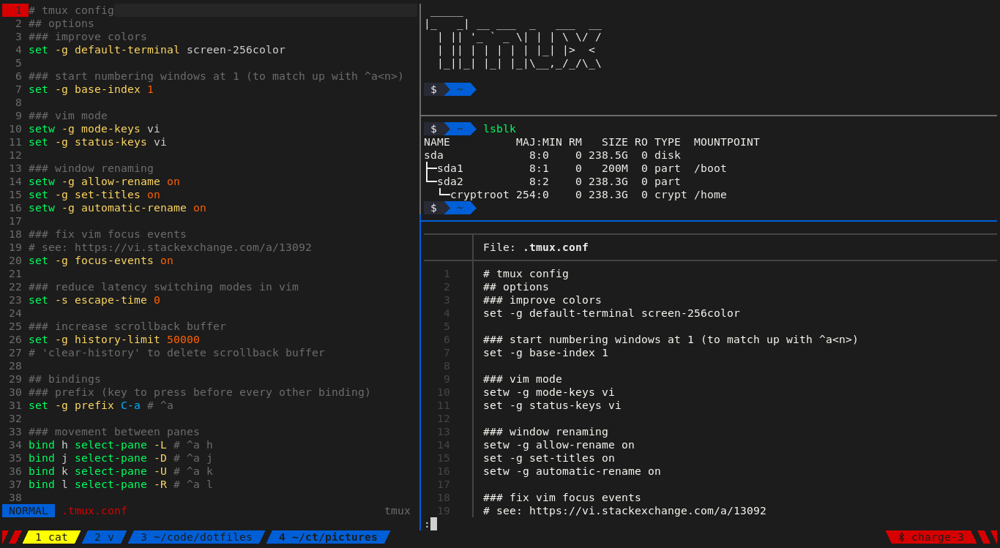
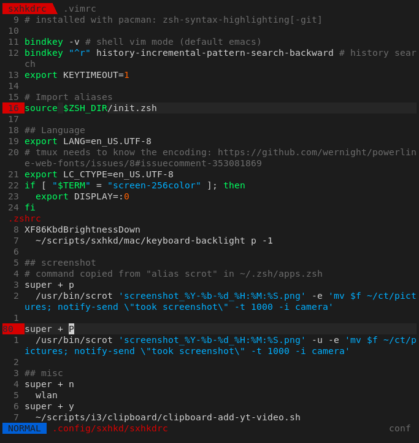
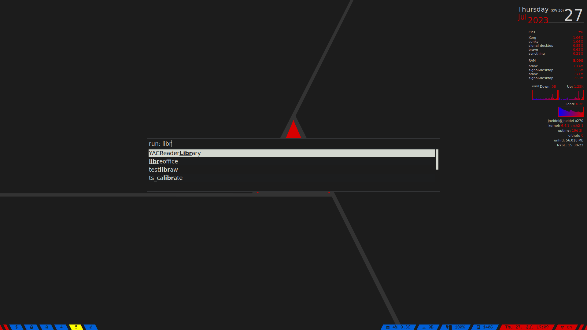

# dotfiles

> Collection of config files, install scripts, list of used apps

<details>
<summary><strong>Table of Contents</strong></summary>

<!-- toc -->

- [Terminal apps](#terminal-apps)
  * [zsh (shell)](#zsh-shell)
  * [tmux (terminal mutiplexer)](#tmux-terminal-mutiplexer)
  * [vim (terminal editor)](#vim-terminal-editor)
  * [git (version control)](#git-version-control)
- [GUI apps](#gui-apps)
  * [kitty (terminal)](#kitty-terminal)
  * [mpv (video/audio player)](#mpv-videoaudio-player)
  * [rofi (application launcher/dmenu)](#rofi-application-launcherdmenu)
- [System apps](#system-apps)
  * [sxhkd (hotkey daemon)](#sxhkd-hotkey-daemon)
  * [i3 (window manager)](#i3-window-manager)
- [CLIs](#clis)
- [Browser Extensions](#browser-extensions)
- [Android apps](#android-apps)
- [OSX](#osx)
- [Related](#related)

<!-- tocstop -->

</details></br>

<details>
<summary><strong>How this repos config deployment works</strong></summary>

Using [`./import-configs`](import-configs) (pull local configs into directory) and
[`./install-configs`](install-configs) (install configs from directory in the system)
you can get/set config files based on what you are currently using (listed in
[`used-apps`](used-apps)).
The [`used-apps`](used-apps) file lists categories defined in [`mappings`](mappings),
for example the category `zsh` is defined as:

```
[zsh]
.zshrc
.zsh
```

Which means, that if `zsh` is listed in `used-apps` on import/install the file
`~/.zshrc` and the directory `~/.zsh/` will be copied.

</details>

<details>
<summary><strong>How this repos app install works</strong></summary>

Using [`./apps-install`](apps-install) you can install all apps that you are
currently using.
These are listed in [`used-apps`](used-apps), the categories of which are
defined in [`apps`](apps). For example the NetworkManager category:

```
[nm]
networkmanager NetworkManger
systemd:NetworkManager
```

Which if `nm` is in `used-apps` will run `yay -S networkmanager` and `sudo
systemctl enable NetworkManager` after the install. The first argument is the
package, the rest is description. Prefixes (like `systemd:`), are for doing
non-pacman stuff (npm install, etc.).

</details>

**Warning:** Not all configs in the repo are actively being used. See
'how it works' above.

## Terminal apps

### zsh (shell)

Superior shell, extends bash/posix.

I'm using a stripped down version of
[oh-my-zsh](https://github.com/robbyrussell/oh-my-zsh) with a lot of custom
aliases.

- [main config](.zshrc)
- [secondary configs, aliases](.zsh)
- [theme](.zsh/cobalt2.zsh-theme)

### tmux (terminal mutiplexer)

Multiple shells within the same terminal, screen splitting and [much more](https://github.com/tmux/tmux/wiki).

- [main config](.tmux.conf)
- [scripts](scripts/tmux)



### vim (terminal editor)

Neovim with custom macros, hooks and a few plugins.

- [main config](.vimrc)
- [secondary configs](.vim/config)
- [plugins](install-scripts/vim-plugins.sh) [writeup](docs/vim.md)
- [colorscheme](.vim/colors/old-hope.vim)
- [nvim entry](.config/nvim/init.vim)



<!--### Eslint (js linter)

[View eslint config](https://raw.githubusercontent.com/jneidel/dotfiles/master/.eslintrc) - `~/.eslintrc`
[View eslint typescript config](https://raw.githubusercontent.com/jneidel/dotfiles/master/.eslintrc-ts) - `~/.eslintrc-ts`

Once globally installed, run anywhere:

```zsh
# for js
eslint --fix .

# for ts
eslint -c ~/.eslintrc-ts --fix .
```

See [eslint aliases](https://github.com/jneidel/dotfiles/blob/master/manjaro/.zsh/eslint.zsh) for shortcuts.

Requires eslint, as well as a few plugins to be installed globally:

```zsh
# for js
npm i -g eslint eslint-plugin-node eslint-plugin-unicorn eslint-plugin-json eslint-plugin-xo eslint-config-xo

# for js & ts
npm i -g eslint eslint-plugin-node eslint-plugin-unicorn eslint-plugin-json eslint-plugin-xo eslint-config-xo eslint-config-xo-typescript @typescript-eslint/parser @typescript-eslint/eslint-plugin
```

For an easy start into eslint try [eslint-nibble](https://github.com/IanVS/eslint-nibble).
-->

### git (version control)

- [global config](.gitconfig)
- [global gitignore](.gitignore-global)

## GUI apps
### kitty (terminal)

Fast, easy to configure, batteries included.

- [main config](.config/kitty/kitty.conf)
- [main colorscheme](.config/kitty/jneidel-colors.conf)
- see directory for [light setup](.config/kitty)

### mpv (video/audio player)

Everything you'll ever need from a video player.

- [config](.config/mpv/mpv.conf)
- [keybindings](.config/mpv/input.conf)


### rofi (application launcher/dmenu)

- [config](.config/rofi/config)
- [colorscheme](scripts/rofi/rofi-arc-dark.rasi)
- [scripts](scripts/rofi)



## System apps
### sxhkd (hotkey daemon)

The essential hotkey daemon.

- [config](.config/sxhkd/sxhkdrc)

### i3 (window manager)

Lightweight window manager.

- [config](.i3/config)

## CLIs

**npm:**

| name | description | links |
|--|--|--|
| fkill | Interactive process killer | [npm](https://www.npmjs.com/package/fkill-cli) [git](https://github.com/sindresorhus/fkill-cli) |
| dict-cc | Dict.cc lookup from the command line | [npm](https://www.npmjs.com/package/dict-cc-cli) [git](https://github.com/derhuerst/dict-cc-cli) |
| tslide | Terminal slide deck using markdown | [npm](https://www.npmjs.com/package/tslide) [git](https://github.com/tslide/tslide) |
| alder | Print current directory as ascii tree | [npm](https://www.npmjs.com/package/@aweary/alder) [git](https://github.com/aweary/alder) |

**npm development:**

| name | description | links |
|--|--|--|
| markdown-toc | Generate markdown toc | [npm](https://www.npmjs.com/package/markdown-toc) [git](https://github.com/jonschlinkert/markdown-toc) |
| np | Better version of 'npm publish' | [npm](https://www.npmjs.com/package/np) [git](https://github.com/sindresorhus/np) |
| npm-name | Check module name availability | [npm](https://www.npmjs.com/package/npm-name-cli) [git](https://github.com/sindresorhus/npm-name-cli) |
| yo | Run yeoman generators to create boilerplates | [npm](https://www.npmjs.com/package/yo) [git](https://github.com/yeoman/yo) |
| generator-jneidel | Collection of boilerplates, for installation with yeoman | [npm](https://www.npmjs.com/package/generator-jneidel) [git](https://github.com/jneidel/generator-jneidel) |

**General:**

| name | description | links |
|--|--|--|
| tmux | Terminal multiplexer | [pacman](https://aur.archlinux.org/packages/tmux-git/) [homebrew](http://brewformulas.org/tmux) [git](https://github.com/tmux/tmux) |
| youtube-dl | Configurable youtube downloader | [pacman](https://aur.archlinux.org/packages/youtube-dl-git/) [git](https://github.com/rg3/youtube-dl) |

**General development:**

| name | description | links |
|--|--|--|
| grip | Render readme with github styles for local testing | [pacman](https://aur.archlinux.org/packages/python-grip/) [homebrew](http://brewformulas.org/grip) [git](https://github.com/joeyespo/grip) |
| jq | JSON processor | [pacman](https://aur.archlinux.org/packages/jq-git/) [git](https://github.com/stedolan/jq) |

<!--**Pacman (Manjaro Linux):**

| asciinema | Terminal recorder | [git](https://github.com/asciinema/asciinema) [pip3](https://pypi.python.org/pypi/asciinema) |

| name | description | links |
|--|--|--|
|  |  |  |
-->

## Browser Extensions

Browser extensions, sorted by category.

**Essentials:**

| name | description | links |
|--|--|--|
| uBlock Origin | Best free (as in freedom) adblocker | [firefox](https://addons.mozilla.org/en-US/firefox/addon/ublock-origin/) [chrome](https://chrome.google.com/webstore/detail/cjpalhdlnbpafiamejdnhcphjbkeiagm) |
| Vimium | Navigate browser with vim shortcuts | [firefox](https://addons.mozilla.org/en-US/firefox/addon/vimium-ff/) [chrome](https://chrome.google.com/webstore/detail/vimium/dbepggeogbaibhgnhhndojpepiihcmeb) [git](https://github.com/philc/vimium) |
| HTTPS Everywhere | Force encrypted connections (HTTPS) | [firefox](https://addons.mozilla.org/en-US/firefox/addon/https-everywhere/) [chrome](https://chrome.google.com/webstore/detail/https-everywhere/gcbommkclmclpchllfjekcdonpmejbdp) |
| Dark Reader | Dark mode for websites | [firefox](https://addons.mozilla.org/en-US/firefox/addon/darkreader) [chrome](https://chrome.google.com/webstore/detail/dark-reader/eimadpbcbfnmbkopoojfekhnkhdbieeh) [git](https://github.com/darkreader/darkreader) |
| Privacy Badger | Stop suspicious trackers | [firefox](https://addons.mozilla.org/en-US/firefox/addon/privacy-badger17/) [chrome](https://chrome.google.com/webstore/detail/privacy-badger/pkehgijcmpdhfbdbbnkijodmdjhbjlgp) |
| KeePassXC-Browser | KeePass integration for password insert | [firefox](https://addons.mozilla.org/en-US/firefox/addon/keepassxc-browser/) [chrome](https://chrome.google.com/webstore/detail/keepassxc-browser/oboonakemofpalcgghocfoadofidjkkk) [git](https://github.com/keepassxreboot/keepassxc-browser) |

**Privacy:**

Firefox (nightly) is my main browser. I have it setup to delete cookies and history on exit. You can find these options under "Privacy & Security".

| name | description | links |
|--|--|--|
| NoScript | Block domains from executing javascript | [firefox](https://addons.mozilla.org/en-US/firefox/addon/noscript/) |
| Chameleon | Easily spoof user-agents & more | [firefox](https://addons.mozilla.org/en-US/firefox/addon/chameleon-ext/) [git](https://github.com/sereneblue/chameleon) |
| Decentraleyes | Stop tracking through CDNs | [firefox](https://addons.mozilla.org/en-US/firefox/addon/decentraleyes) [chrome](https://chrome.google.com/webstore/detail/decentraleyes/ldpochfccmkkmhdbclfhpagapcfdljkj) [git](https://git.synz.io/Synzvato/decentraleyes) |
| Disable WebRTC | Stop IP leakage while using a VPN | [firefox](https://addons.mozilla.org/en-US/firefox/addon/happy-bonobo-disable-webrtc/) |

For an more infos on why these plugins are important view [privacytools.io](https://www.privacytools.io/#addons).

[See my exported settings](.firefox-extension-data/readme.md) for some of the addons.

**Coding:**

Chromium is my browser for web-development.

| name | description | links |
|--|--|--|
| Chrome Markdown Preview | Elegant GFM preview on `.md` files | [chrome](https://chrome.google.com/webstore/detail/chrome-markdown-preview/ghmocdlbmpcchcbkkingnkgemjacgfdf) [git](https://github.com/zce/chrome-markdown) |
| JSON Formatter | Easy to read JSON formatting | [chrome](https://chrome.google.com/webstore/detail/json-formatter/bcjindcccaagfpapjjmafapmmgkkhgoa) [git](https://github.com/callumlocke/json-formatter) |
| Modify Header Value | Set HTTP headers | [firefox](https://addons.mozilla.org/en-US/firefox/addon/modify-header-value) [chrome](https://chrome.google.com/webstore/detail/modify-header-value-http/cbdibdfhahmknbkkojljfncpnhmacdek) [homepage](https://mybrowseraddon.com/modify-header-value.html) |
| OpenGenus quark | Offline algorithm search engine | [chrome](https://chrome.google.com/webstore/detail/opengenus-offline-search/lfoloadpfjildomeafpdopahkdaoofbn) [git](https://github.com/OpenGenus/quark) |
| npmhub | List npm dependencies in readme | [chrome](https://chrome.google.com/webstore/detail/npmhub/kbbbjimdjbjclaebffknlabpogocablj) [git](https://github.com/npmhub/npmhub) |
| Refined GitHub | GitHub functional/visual upgrade | [chrome](https://chrome.google.com/webstore/detail/refined-github/hlepfoohegkhhmjieoechaddaejaokhf) [git](https://github.com/sindresorhus/refined-github) |

<details>
<summary><strong>More GitHub related plugins</strong></summary>

A comprehensive list of GitHub chrome extensions can be found [here](https://github.com/stefanbuck/awesome-browser-extensions-for-github).

| name | description | links |
|--|--|--|
| Octotree | GitHub file tree | [chrome](https://chrome.google.com/webstore/detail/octotree/bkhaagjahfmjljalopjnoealnfndnagc) [git](https://github.com/buunguyen/octotree/) |
| Vscode-icons | Icons indicating file type | [chrome](https://chrome.google.com/webstore/detail/github-vscode-icons/hoccpcefjcgnabbmojbfoflggkecmpgd) [git](https://github.com/dderevjanik/github-vscode-icons) |
| Lovely Forks | Shows notable forks | [chrome](https://chrome.google.com/webstore/detail/lovely-forks/ialbpcipalajnakfondkflpkagbkdoib) [git](https://github.com/musically-ut/lovely-forks) |
| npm-stats | Display npm download stats in repo | [chrome](https://chrome.google.com/webstore/detail/github-npm-stats/oomfflokggoffaiagenekchfnpighcef) [git](https://github.com/katranci/github-npm-stats) |
| show-email | Display email on profile, even if not provided | [chrome](https://chrome.google.com/webstore/detail/github-show-email/pndebicblkfcinlcedagfhjfkkkecibn) [git](https://github.com/prabhakar267/github-email-extractor) |
| omnibar | Shortcut navigation for github | [chrome](https://chrome.google.com/webstore/detail/github-omnibar/njccjmmakcbdpnlbodllfgiloenfpocb/related?utm_source=chrome-ntp-icon) [git](https://github.com/jcouyang/gh-omnibar) |
| issue-link-status | Colorize issue links depending on status | [chrome](https://chrome.google.com/webstore/detail/github-issue-link-status/nbiddhncecgemgccalnoanpnenalmkic) [git](https://github.com/bfred-it/github-issue-link-status/) |
| build-tabs | Build tab for github | [chrome](https://chrome.google.com/webstore/detail/builds-tab-for-github/jnmdkbflmkjehkkdbjdfpmhgdafpcdkh) [git](https://github.com/duxet/builds-tab) |
| github-autocomplete | Github search autocomplete | [chrome](https://chrome.google.com/webstore/detail/awesome-autocomplete-for/djkfdjpoelphhdclfjhnffmnlnoknfnd) [git](https://github.com/algolia/github-awesome-autocomplete) |
| github-plus | Display repo size, download links | [chrome](https://chrome.google.com/webstore/detail/github-plus/anlikcnbgdeidpacdbdljnabclhahhmd) [git](https://github.com/softvar/github-plus) |

<!-- |  |  | [chrome]() [git]() | -->

</details><br/>

**Misc:**

| name | description | links |
|--|--|--|
| Easy to RSS | Get the rss feeds of the current site | [firefox](https://addons.mozilla.org/en-GB/firefox/addon/easy-to-rss/) [chrome](https://chrome.google.com/webstore/detail/easy-to-rss/hbcmpkcpbnecinpngdnfbnknfkdpdfli) [git](https://github.com/idealclover/Easy-to-RSS) |
| SoundCloudOG | Filter reposts out of your soundcloud stream | [chrome](https://chrome.google.com/webstore/detail/soundcloudog/enegaliobdmmnlcgdfljpebckdfbgcai) |
| Universal Bypass | Bypass annoying link shorteners | [firefox](https://addons.mozilla.org/en-US/firefox/addon/universal-bypass) [chrome](https://chrome.google.com/webstore/detail/universal-bypass/aihomhdbhpnpmcnnbckjjcebjoikpihj) [git](https://github.com/timmyrs/Universal-Bypass) |
| Dict.cc Translation | Quick translations | [firefox](https://addons.mozilla.org/firefox/addon/dictcc-translation/) [git](https://github.com/Lusito/dict.cc-translation) |

<details>
<summary><strong>Maybes (not in current use)</strong></summary>

| name | description | links |
|--|--|--|
| IMDb Ratings on Netflix | Show ratings on overview pages | [firefox](https://addons.mozilla.org/en-US/firefox/addon/imdb-ratings-on-netflix) [chrome](https://chrome.google.com/webstore/detail/imdb-ratings-on-netflix/ohonjgnjobblbhfeamidafpnbkppbljh) [git](https://github.com/pawanmaurya/imdb-ratings-on-netflix) |
| StayFocusd | Site blocker, limit black list to given time | [chrome](https://chrome.google.com/webstore/detail/stayfocusd/laankejkbhbdhmipfmgcngdelahlfoji) |
| Toby | Better bookmark manager | [chrome](https://chrome.google.com/webstore/detail/toby-for-chrome/hddnkoipeenegfoeaoibdmnaalmgkpip) |
| Hover Zoom+ | Large overlay on image and link to image hover | [chrome](https://chrome.google.com/webstore/detail/hover-zoom%20/pccckmaobkjjboncdfnnofkonhgpceea) [git](https://github.com/extesy/hoverzoom/) |
| Theater Mode for YouTube | Activate theater mode for all yt videos | [firefox](https://addons.mozilla.org/en-US/firefox/addon/theater-mode-for-youtube/) |

</details><br/>

**Theme:**

I use **Arc Dark** as I based my terminal colorscheme on it.
[firefox](https://addons.mozilla.org/en-US/firefox/addon/arc-dark-theme-we/)
[chrome](https://chrome.google.com/webstore/detail/arc-dark/adicoenigffoolephelklheejpcpoolk)

## Android apps

I am running [LineageOS](https://lineageos.org).

F-Droid is a software repository hosting free and (mostly) open source apps. If available always try to use F-Droid over the google play store. Read more on [F-Droid](https://f-droid.org/). Most fdroid apps are also on gplay, even if I did not include them here.

Ordered by importance.

| name | description | links |
|--|--|--|
| Signal | Privacy friendly messaging, end to end encrypted chat | [gplay](https://play.google.com/store/apps/details?id=org.thoughtcrime.securesms) [git](https://github.com/signalapp/Signal-Android) |
| f.lux | Bluelight filter (root) | [gplay](https://play.google.com/store/apps/details?id=com.justgetflux.flux) [website](https://justgetflux.com/) |
| Time Meter | Smooth time tracker, with exports | [gplay](https://play.google.com/store/apps/details?id=com.rk.timemeter) |
| Simple Calendar | Calendar | [fdroid](https://f-droid.org/packages/com.simplemobiletools.calendar.pro/) [git](https://github.com/SimpleMobileTools/Simple-Calendar) |
| Vinyl | Full featured music player | [fdroid](https://f-droid.org/packages/com.poupa.vinylmusicplayer/) [gplay](https://play.google.com/store/apps/details?id=com.poupa.vinylmusicplayer) [git](https://github.com/AdrienPoupa/VinylMusicPlayer) |
| OI Shopping List | Shopping list | [fdroid](https://f-droid.org/packages/org.openintents.shopping) |
| M.A.L.P. | MPD client | [fdroid](https://f-droid.org/en/packages/org.gateshipone.malp) |
| FBReader | Ebook reader | [fdroid](https://f-droid.org/packages/org.geometerplus.zlibrary.ui.android/) [gplay](https://play.google.com/store/apps/details?id=org.geometerplus.zlibrary.ui.android&referrer=utm_source%3Dfbreader.org%26utm_medium%3Dbadge%26utm_content%3Dandroid-page-bottom%26utm_campaign%3Dbadge) [git](https://github.com/geometer/FBReaderJ) |
| DuckDuckGo | Browser | [fdroid](https://f-droid.org/en/packages/com.duckduckgo.mobile.android/) |
| Markor | Markdown editor, notes app | [fdroid](https://f-droid.org/en/packages/net.gsantner.markor/) [gplay](https://play.google.com/store/apps/details?id=net.gsantner.markor) [git](https://github.com/gsantner/markor) |
| K-9 Mail | Mail | [fdroid](https://f-droid.org/en/packages/com.fsck.k9) [sync-setup](https://github.com/k9mail/k-9/issues/857#issuecomment-397109350) |
| dict.cc | Offline dictionary | [gplay](https://play.google.com/store/apps/details?id=cc.dict.dictcc) |
| Öffi | Public transport planning | [fdroid](https://f-droid.org/en/packages/de.schildbach.oeffi/) |
| OsmAnd | Navigation | [fdroid](https://f-droid.org/packages/net.osmand.plus/) [gplay](https://play.google.com/store/apps/details?id=net.osmand) |
| Alarmio | Alarm clock, timer | [fdroid](https://f-droid.org/en/packages/me.jfenn.alarmio/) [git](https://github.com/fennifith/Alarmio) |
| DAVx⁵ | CalDAV sync | [fdroid](https://f-droid.org/packages/at.bitfire.davdroid/) [website](https://www.davx5.com) [setup explaination](docs/caldav.md) |
| Open Camera | Camera | [fdroid](https://f-droid.org/en/packages/net.sourceforge.opencamera/) [git](https://sourceforge.net/p/opencamera/code) |
| p!n | Pin notes as notifications | [fdroid](https://f-droid.org/en/packages/de.nproth.pin/) [git](https://github.com/nproth/pin) |
| primitive ftpd | ftp server | [fdroid](https://f-droid.org/en/packages/org.primftpd/) [git](https://github.com/wolpi/prim-ftpd) |
| Termux | Terminal emulator | [fdroid](https://f-droid.org/en/packages/com.termux/) [git](https://github.com/termux/termux-app) |
| Amaze | File manager | [fdroid](https://f-droid.org/packages/com.amaze.filemanager/) [git](https://github.com/TeamAmaze/AmazeFileManager) |
| Audipo | Audio player optimized for podcasts (speed, skipping) | [gplay](https://play.google.com/store/apps/details?id=jp.ne.sakura.ccice.audipo) |
| MuPDF | PDF viewer | [fdroid](https://f-droid.org/en/packages/com.artifex.mupdf.viewer.app) |
| Anki | Flashcards | [fdroid](https://f-droid.org/en/packages/com.ichi2.anki/) [gplay](https://play.google.com/store/apps/details?id=com.ichi2.anki) [git](https://github.com/ankidroid/Anki-Android) |
| MX Player | Video player (better than vlc) | [gplay](https://play.google.com/store/apps/details?id=com.mxtech.videoplayer.pro) |
| My Expenses | Expense/income tracker, with exports | [fdroid](https://f-droid.org/repository/browse/?fdid=org.totschnig.myexpenses) [gplay](https://play.google.com/store/apps/details?id=org.totschnig.myexpenses) [git](https://github.com/mtotschnig/MyExpenses) |
| HiPER Calc | Superior calculator | [gplay](https://play.google.com/store/apps/details?id=cz.hipercalc.pro) |
| KeePass DX | Mobile keepass database | [fdroid](https://f-droid.org/en/packages/com.kunzisoft.keepass.libre) |
| Vespucci | OSM Editor | [fdroid](https://f-droid.org/en/packages/de.blau.android) |
| Micopi+ | Generate profile picture for contacts | [fdroid](https://f-droid.org/en/packages/com.easytarget.micopi) |
| Voice | Audiobook player (more formats than audiopo, but inferior interface) | [fdroid](https://f-droid.org/en/packages/de.ph1b.audiobook) |
| DNS66 | Mobile hosts file | [fdroid](https://f-droid.org/en/packages/org.jak_linux.dns66) |
| Binary Eye | QR reader | [fdroid](https://f-droid.org/en/packages/de.markusfisch.android.binaryeye) |

<details>
<summary><strong>Maybes (not in current use)</strong></summary>

| name | description | links |
|--|--|--|
| JuiceSSH | Mobile mosh (ssh) client | [fdroid](https://play.google.com/store/apps/details?id=com.sonelli.juicessh) |
| Macros | Calorie Counter | [gplay](https://play.google.com/store/apps/details?id=com.josmantek.macros) |
| Relaxio | White-noise player | [gplay](https://play.google.com/store/apps/details?id=net.relaxio.relaxio) |
| CamScanner | Document scanner | [gplay](https://play.google.com/store/apps/details?id=com.intsig.camscanner) |
| StreetComplete | Simplified OSM contribution | [fdroid](https://f-droid.org/en/packages/de.westnordost.streetcomplete) |
| Dicer | Roll dices | [fdroid](https://f-droid.org/en/packages/org.secuso.privacyfriendlydicer) |
| Tape Measure | Measure distances in an image | [fdroid](https://f-droid.org/en/packages/org.secuso.privacyfriendlytapemeasure) |
| Scrambled Exif | Remove metadata from images before sharing them | [fdroid](https://f-droid.org/en/packages/com.jarsilio.android.scrambledeggsif) |
| DeuFeiTage | German holidays | [fdroid](https://f-droid.org/en/packages/de.micmun.android.deufeitage) |
| MPDroid | Alternative MPD client | [fdroid](https://f-droid.org/en/packages/com.namelessdev.mpdroid) |
| Bluelight Filter | Filters the bluelight, easier on the eyes, set filter based on time | [gplay](https://play.google.com/store/apps/details?id=jp.ne.hardyinfinity.bluelightfilter.free) |

</details>

## OSX

My osx install is no longer maintained, but you can still [explore the files here](https://github.com/jneidel/dotfiles/tree/bd758ada365a9fc2e7d4dc0b456684cfe88dc2bd/osx).

## Related

[generator-jneidel](https://github.com/jneidel/generator-jneidel) - My personal collection of boilerplates, for installation with yeoman

